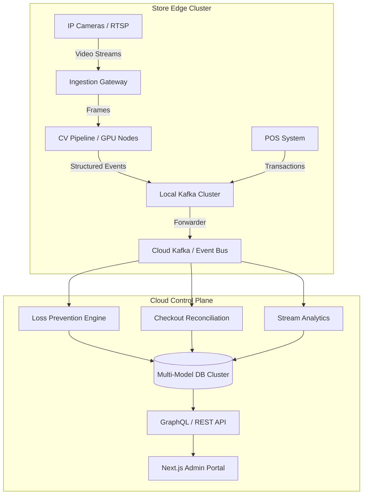
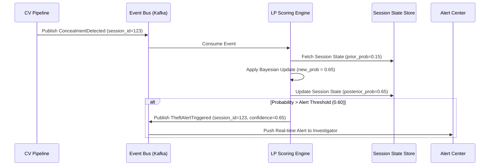
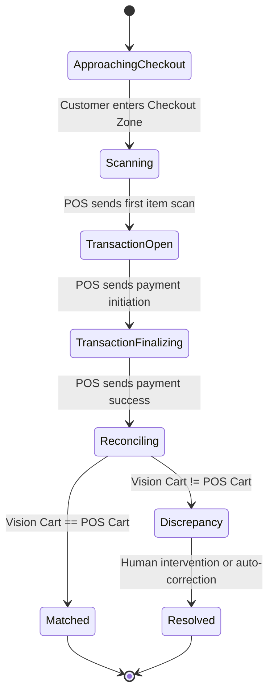
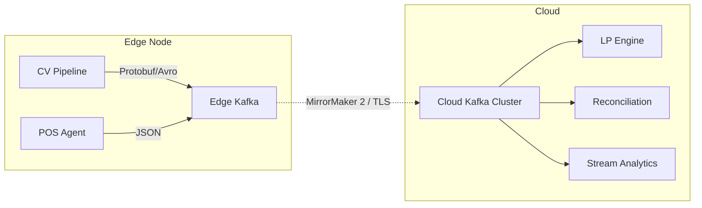
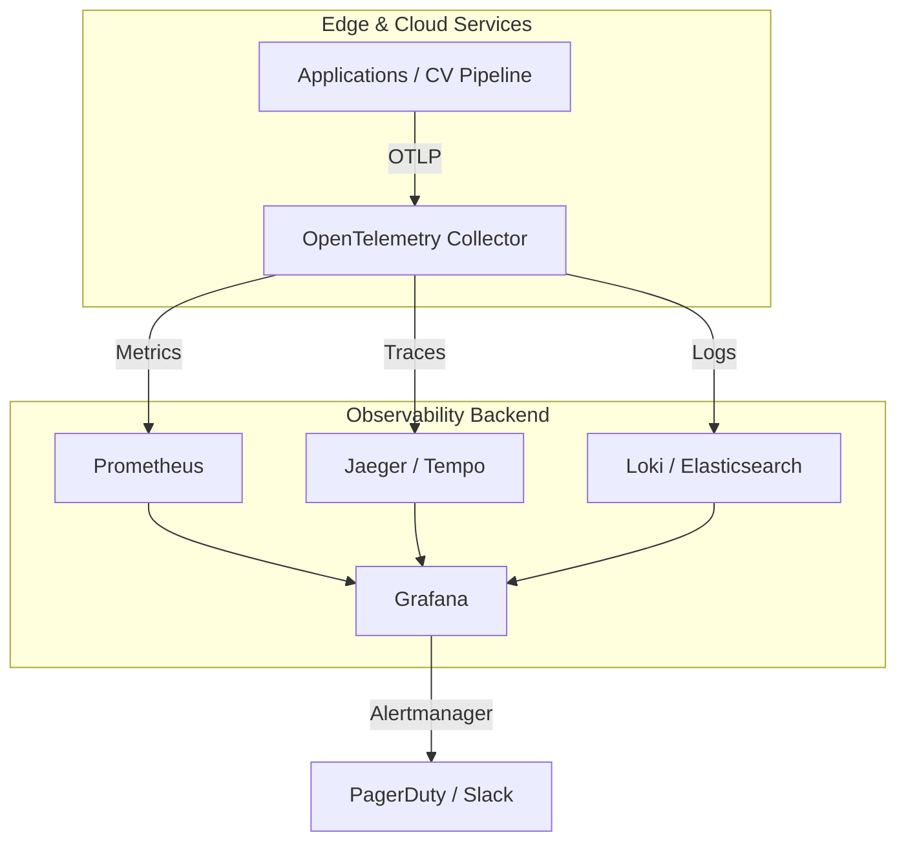
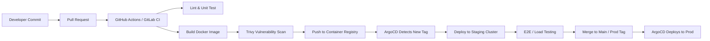

# Enterprise Retail Intelligence Platform 
## Software Requirements Specification (SRS) & Technical Design Document (TDD)

**Document Version:** 1.0.0
**Status:** Draft for Engineering Review
**Architectural Lead:** Senior Engineering Council

---

## 1.0 Introduction & System Overview

### 1.1 Vision and Objective
The Retail Intelligence Platform is an enterprise-grade, AI-powered retail operating system designed to transcend the limitations of traditional "cashier-less checkout" systems. While companies like Amazon Just Walk Out or Standard AI primarily focus on autonomous checkout, this platform is designed as a holistic retail intelligence suite. It encompasses computer vision, event-driven architecture, real-time analytics, digital twin visualization, and predictive modeling. 

The objective is to process dozens of simultaneous camera feeds per store, track hundreds of customers and employees, reconstruct shopping sessions with near-perfect accuracy, detect complex theft patterns, reconcile vision data with Point-of-Sale (POS) systems, and provide a highly interactive administrative digital twin of the physical store. 

### 1.2 Core Capabilities
The platform must deliver the following functional pillars:
1. **Customer & Multi-Camera Tracking:** Continuous identity persistence across non-overlapping camera views, trajectory mapping, and session reconstruction.
2. **Product Interaction Understanding:** Hand-shelf interaction, pickup detection, return detection, and SKU/Shelf-region recognition.
3. **Loss Prevention (LP):** A probabilistic, event-driven engine that calculates theft confidence based on multi-signal correlation, replacing brittle rule-based systems.
4. **Checkout Verification:** Real-time reconciliation between vision-inferred carts and POS transaction states.
5. **Store Analytics & Digital Twin:** An editable, spatially accurate digital representation of the physical store, mapped to real-world coordinates, supporting heatmaps, planogram compliance, and operational monitoring.
6. **Scalability & Fault Tolerance:** Designed for horizontal scaling across hundreds of stores, capable of ingesting millions of events per minute without data loss.

### 1.3 Non-Goals (Current Scope)
- Autonomous robotic inventory scanning (future roadmap integration only).
- Direct integration with legacy on-premise monolithic ERP systems without middleware.
- Physical hardware manufacturing (cameras, sensors); the system is hardware-agnostic but requires specific camera capabilities (RTSP, H.264/H.265).

---

## 2.0 High-Level Architecture & Input Modalities

### 2.1 Architectural Philosophy
The system employs a hybrid Edge-Cloud architecture. Computer Vision (CV) inference is extremely bandwidth-intensive and latency-sensitive. Sending raw video streams to the cloud is economically and technically unviable at scale. Therefore, edge computing nodes (GPU-enabled servers physically located in the store or regional data centers) handle video ingestion, model inference, and event generation. The cloud handles event aggregation, complex probabilistic reasoning, analytics, long-term storage, and the admin portal.

The architecture is strictly **Event-Driven** and utilizes **CQRS (Command Query Responsibility Segregation)**. The edge systems generate immutable facts (events); the cloud systems consume these facts to build read-optimized projections (digital twin state, heatmaps, theft scores).

### 2.2 High-Level Topology



### 2.3 Input Modalities & Abstraction Layer
To ensure modularity, the system abstracts all input sources into a unified `IInputSource` interface. This allows the platform to operate in testing environments, synthetic simulations, and production deployments seamlessly.

1. **RTSP / IP Cameras (Production):** Consumed via GStreamer or FFmpeg bindings. The ingestion gateway handles connection pooling, automatic reconnection with exponential backoff, and hardware-accelerated decoding (NVDEC).
2. **Uploaded Videos / CCTV Recordings (Testing/Forensics):** Handled identically to RTSP but without network jitter. Used for regression testing and forensic investigation.
3. **Webcam (Development):** Supported via local OS-level media frameworks for rapid prototyping.
4. **Synthetic Data Generators (Simulation):** A 3D engine (e.g., Unity or Unreal Engine integration) generates synthetic video feeds and ground-truth metadata. This is critical for testing edge cases (e.g., specific theft scenarios) that are rare in real life.
5. **Manual Event Injection (QA):** A REST API allowing engineers to inject synthetic events (e.g., "Product X picked up at Timestamp Y") directly into the event bus, bypassing the CV pipeline, to test downstream reasoning engines.
6. **POS & Inventory Simulation:** Simulators that generate realistic transaction streams and inventory deltas to test reconciliation logic.

*Design Trade-off:* Abstracting inputs adds a slight overhead due to adapter layers, but it ensures that the core CV pipeline and reasoning engines are completely decoupled from the physical hardware, drastically simplifying testing and deployment.

---

## 3.0 Computer Vision Pipeline (Edge Architecture)

The CV pipeline is the most computationally expensive and technically complex subsystem. It must process high-framerate video from dozens of cameras with sub-100ms latency to ensure real-time tracking and interaction detection.

### 3.1 Camera Ingestion & Frame Buffering
**Why it exists:** Directly feeding every decoded frame to the inference engines overwhelms GPU memory and compute. Network jitter and packet loss require resilient buffering mechanisms.

**How it works:**
The Ingestion Gateway uses a multi-stage process. First, it establishes an RTSP session. The raw H.264/H.265 stream is routed to a hardware decoder (e.g., NVIDIA NVDEC). Decoded frames (RAW RGB or YUV) are placed into a zero-copy ring buffer in GPU memory.

**Frame Synchronization:** Cameras are not hardware-synced. Timestamps are extracted from RTSP RTP headers (NTP timestamps). If NTP sync fails, the system falls back to local ingestion timestamps. A synchronization module aligns frames from overlapping cameras within a temporal window (e.g., 50ms) to allow cross-camera tracking algorithms to correlate identities accurately.

**Failure Scenarios:** If a camera stream drops, the gateway triggers an exponential backoff retry (1s, 2s, 4s, 8s... up to 60s). If the retry fails, it emits a `CameraOffline` event to the cloud and halts processing for that stream, freeing GPU resources.

### 3.2 Frame Sampling & GPU Scheduling
**Problem:** Running object detection, pose estimation, and interaction detection on every frame of a 30fps stream across 30 cameras is computationally impossible on edge hardware.

**Solution (Dynamic Frame Skipping & Sampling):**
The pipeline utilizes a state-machine approach to frame sampling. 
- **State 1 (Idle):** When no customers are in the camera's field of view (FOV), the pipeline decodes and processes 1 frame per second (fps) to maintain a low-power state.
- **State 2 (Active Tracking):** When a person is detected, the pipeline increases processing to 10-15 fps. 
- **State 3 (Interaction):** When a hand is near a shelf, the pipeline spikes to 25-30 fps for that specific cropped region of interest (ROI) to capture the fast micro-movements of product pickup.

**GPU Scheduling:** Inference requests are batched dynamically. The scheduler maintains a priority queue. High-priority tasks (e.g., interaction detection) preempt low-priority tasks (e.g., background idle scanning). We utilize NVIDIA Triton Inference Server to manage model concurrency, GPU memory allocation, and dynamic batching.

### 3.3 Inference Optimization
**Problem:** Deep learning models (e.g., YOLO, Vision Transformers) are slow when run naively via PyTorch in production.

**Approach & Alternatives:**
1. **PyTorch Native (Training only):** Used strictly for model training and validation.
2. **ONNX Runtime (Fallback):** Framework-agnostic. Good for portability across different hardware vendors (e.g., AMD GPUs, ARM CPUs), but lacks peak optimization.
3. **NVIDIA TensorRT (Production Choice):** We standardize on TensorRT for edge deployment. Models are compiled into TensorRT engines using FP16 (half-precision) or INT8 quantization. 

**Trade-off:** TensorRT locks the system into NVIDIA hardware. However, the performance gain (often 3x-5x over ONNX) and the maturity of NVIDIA's video processing SDK (DeepStream) justify this hardware lock-in for the edge tier.

**Inference Caching:** For static elements (shelves, exits, walls), an inference cache is maintained. If a frame's background hasn't changed (calculated via cheap perceptual hashing like pHash), background detections are reused, and inference is only run on ROIs where motion is detected (via background subtraction).

### 3.4 Model Orchestration: The Perception Stack
The perception stack is a cascaded pipeline. Models are not run simultaneously on the whole frame; they are triggered conditionally based on prior detections to save compute.

1. **Base Object Detection (Person, Cart, Basket):** 
   - *Model:* Custom YOLOv9 or RT-DETR optimized for retail environments.
   - *Output:* Bounding boxes, class labels, confidence scores.
2. **Pose Estimation & Hand Detection:**
   - *Trigger:* Only run inside the bounding box of a detected `Person`.
   - *Model:* ViTPose or RTMPose. 
   - *Output:* 17+ body keypoints, specifically wrist, elbow, and shoulder joints.
3. **Shelf & Product Detection:**
   - *Trigger:* Run statically during store calibration or dynamically on shelf regions defined in the Digital Twin.
   - *Model:* Fine-tuned detector for specific SKU packaging, with a fallback to empty/filled shelf binary classifier.
4. **Hand-Object Interaction (HOI):**
   - *Trigger:* Activated when a hand keypoint enters a shelf ROI bounding box.
   - *Model:* A spatial-temporal graph convolutional network (ST-GCN) or a lightweight 3D CNN (e.g., X3D) that analyzes a 1-2 second sliding window of frames.
   - *Output:* `PICKUP`, `RETURN`, `BROWSE`, or `CONCEAL` classification.

### 3.5 Multi-Object Tracking (MOT) & Cross-Camera Re-Identification (ReID)
**Problem:** Object detection only tells you *what* is in a frame, not *who* it is over time. Tracking must persist IDs through occlusions and across camera blind spots.

**Single-Camera Tracking:**
We utilize the **ByteTrack** algorithm. ByteTrack is chosen over SORT (Simple Online and Realtime Tracking) because it utilizes low-confidence detection boxes (e.g., a person partially occluded by a shelf) to maintain track continuity, drastically reducing ID switching in crowded aisles. Kalman filters predict future bounding box positions, and Hungarian assignment matches detections to predictions.

**Cross-Camera Re-Identification (ReID):**
When a person leaves Camera A's FOV and enters Camera B's FOV, a naive tracker assigns a new ID. We must maintain a global session ID.

**Approach:** 
1. When a track is lost (not seen for N frames), the edge node extracts a 512-dimensional feature embedding from the last clear frame using an OSNet or Vision Transformer-based ReID model.
2. This embedding, along with the timestamp, last known direction vector, and ground-plane coordinates, is sent to the Cloud ReID Service.
3. When Camera B detects a "new" person, it extracts an embedding and queries the Cloud ReID Service.
4. The service uses a Vector Database (e.g., Milvus or Qdrant) to perform a cosine similarity search among recently lost tracks.
5. **Probabilistic Fusion:** Visual similarity alone is insufficient (people wear similar clothes). The system uses a Bayesian filter that combines:
   - Visual similarity (ReID distance).
   - Spatial-temporal logic (Travel time between Camera A's exit point and Camera B's entrance point vs. average human walking speed).
   - Trajectory projection (Kalman filter extrapolation).
6. If the combined posterior probability exceeds a threshold (e.g., 0.85), the IDs are merged into a single Global Session ID.

**Future Extensibility:** Integration with Bluetooth Low Energy (BLE) beacons or RFID via sensor fusion. If a customer opts into a loyalty app, their BLE MAC address can be fused with visual ReID to establish ground-truth identity.

### 3.6 3D Spatial Mapping & Ground Plane Estimation
**Problem:** 2D pixel coordinates are meaningless for spatial reasoning. We cannot accurately measure distance, speed, or proximity using raw bounding boxes.

**Solution: Homography and Ground Plane Projection**
Every camera must be calibrated. During store commissioning, an administrator uses the Digital Twin Builder to map the 2D camera FOV to a 2D top-down floor plan.
1. The admin clicks on 4+ corresponding points between the camera view and the floor plan.
2. The system calculates the homography matrix ($3 \times 3$).
3. The bottom-center of a person's bounding box (assumed to be the point of contact with the floor) is multiplied by the homography matrix to yield real-world $(X, Y)$ coordinates in the store's local coordinate system.

**Distance Estimation & Occlusion Handling:**
Using the ground plane, the system calculates true Euclidean distances between customers, bypassing the perspective distortion of cameras. For cameras with overlapping FOVs, the system fuses the ground-plane projections to increase accuracy and handle occlusions. If Camera A's view of a person is blocked by an endcap, but Camera B sees them, the system prioritizes Camera B's projection for that specific region.

---
## 4.0 Digital Twin & Spatial Mapping Subsystem

### 4.1 Purpose and Architectural Role
The Digital Twin is not merely a 3D visualization tool for the UI; it is a foundational, mathematically rigorous spatial representation of the physical store. 

**Why it exists:** Computer vision systems operate in 2D pixel space. To answer questions like "Did the customer walk past the checkout?" or "Is this shelf in a blind spot?", the system must translate pixel coordinates into semantic, real-world spatial relationships. The Digital Twin serves as the single source of truth for physical store geometry, camera placement, shelf topology, and logical zones (e.g., "Aisle 4", "Checkout Zone").

**Design Tradeoff (2D vs. 3D):** A full physics-based 3D mesh (e.g., point cloud via LiDAR) provides ultimate accuracy but introduces immense computational overhead for spatial queries (raycasting, collision detection) and is difficult to maintain via a web UI. We utilize a **2.5D approach**: a strictly 2D top-down vector floor plan (polygons, lines) augmented with Z-axis (height) metadata for shelves and camera mounts. This allows for instant point-in-polygon queries, fast graph-based navigation, and easy HTML5 Canvas/WebGL rendering in the browser.

### 4.2 Data Model & Topology
The Twin is modeled as a directed graph of spatial entities.

1. **Polygons (Zones):** Represent areas like `Storage`, `Checkout`, `Aisle`, `Exit`. Used for zone-entry/exit event triggering.
2. **Lines (Shelves):** Represent physical shelving units. Shelves have attributes: `height`, `depth`, `capacity`, `associated_sku_list`.
3. **Nodes (Cameras & IoT):** Represent physical devices. Cameras contain `x, y, z`, `pan`, `tilt`, `fov_degrees`, and a reference to their homography matrix.
4. **Navigation Graph (Waypoints):** A hidden mesh of interconnected nodes representing walkable paths. Used to calculate actual walking distance (not just Euclidean distance) between two points, crucial for travel-time reasoning in ReID and theft detection.

**Versioning & Rollback:** Store layouts change. Aisles are moved, endcaps are swapped. The Digital Twin is fully event-sourced. Every modification generates a `TwinModified` event. The current state is a materialized view of these events. When reviewing historical footage from three months ago, the system queries the Twin state *as it existed at that timestamp*, ensuring accurate spatial reasoning against legacy video.

### 4.3 Camera Coverage & Blind Spot Estimation
During store commissioning, the platform must validate camera placement. 

**How it works:** The system uses 2D raycasting from the camera's node coordinates, bounded by its FOV angle. Rays are cast in 1-degree increments across the FOV. If a ray intersects a shelf polygon (considering its height profile), the ray stops. The resulting unblocked area is projected onto the 2D floor plan.

**Output:** A coverage heatmap. Areas with no ray hits are marked as "Blind Spots". The system flags critical zones (e.g., POS areas, high-value merchandise) if they fall into blind spots. This data is continuously used by the Loss Prevention engine: if a theft event occurs entirely within a known blind spot, the system's confidence score is adjusted downward, and the event is flagged as "unverifiable."

### 4.4 Shelf Interaction Logic
Shelves in the Digital Twin are linked to logical "Interaction Zones." 
When the CV pipeline emits a hand coordinate via homography projection, the Event Bus routes the `(x, y)` coordinate to the Spatial Query Service. The service performs a point-in-polygon test against all shelf interaction zones. 

If a match is found, the raw CV event `Hand Moved` is enriched and transformed into a semantic event: `ShelfInteraction(shelf_id='A4', zone='left_side', session_id='123')`. This semantic enrichment is critical for the downstream reasoning engines, which do not understand pixels, only entities and zones.

---

## 5.0 Loss Prevention (LP) & Probabilistic Theft Detection Engine

### 5.1 Core Philosophy: Moving Beyond Rules
Traditional retail theft detection relies on brittle, single-signal rules (e.g., "If person stands in aisle > 5 minutes, alert"). This generates massive false positives, causing alert fatigue and desensitizing loss prevention officers.

**Our Approach:** We utilize a Probabilistic Event-Driven Engine. Theft is not a single action; it is a sequence of behaviors. We model theft as a Hidden Markov Model (HMM) or Dynamic Bayesian Network (DBN). The system maintains a continuous "Theft Confidence Score" for every active customer session, updating the prior probability as new evidence (events) arrives.

### 5.2 Event Taxonomy & Evidence Accumulation
Every event generated by the CV pipeline, POS system, or Digital Twin spatial engine acts as a likelihood multiplier. We categorize these events into Evidentiary Buckets:

1. **Interaction Anomalies:**
   - `ProductPicked` (Base event)
   - `ProductReturned` (Negative signal for theft)
   - `MultiplePicksNoCart` (Suspicious: picking items but not placing them in a cart/basket)
   - `ConcealmentDetected` (CV model detects hand moving toward pockets/bag immediately after pickup)
   - `BagInteraction` (Hand enters personal bag while in a blind spot)

2. **Spatial & Trajectory Anomalies:**
   - `Loitering` (Velocity < 0.2 m/s for > 3 minutes in a high-value zone)
   - `ShelfEdgeLurking` (Standing abnormally close to shelf, potentially altering packaging)
   - `BlindSpotTraversal` (Routing intentionally through known blind spots)
   - `ExitGateCrossed` (Crossing the geographic boundary of the store without passing POS)

3. **Checkout & POS Anomalies:**
   - `CheckoutSkipped` (Trajectory bypasses all POS zones)
   - `PartialPayment` (Paid for 2 items, vision inferred 5 items in cart)
   - `BarcodeFailure` (Could indicate intentional tag swapping)

### 5.3 Bayesian Scoring Mechanism
Every event modifies the session's theft probability. 

Instead of static weights, we use conditional probabilities. For example, the probability of theft given a `ConcealmentDetected` event ($P(Theft | Concealment)$) is high (e.g., 0.8). However, if that same customer subsequently places the item in a cart, and later pays for it at the POS, the posterior probability collapses.

**Sequence Diagram: LP Event Processing**


### 5.4 Evidence Packages & Human-in-the-Loop
When a session crosses the critical threshold (e.g., 0.85 confidence), the system does not dispatch security automatically. It generates an **Evidence Package** for human review.

**Evidence Package Components:**
1. **Annotated Video Clips:** The edge node is instructed to securely upload a 15-second buffer before and after the triggering event, overlaying bounding boxes, session IDs, and spatial coordinates.
2. **Trajectory Map:** A 2D heat-map of the customer's path through the store, highlighting interaction zones and blind spots.
3. **Event Timeline:** A chronological JSON payload of every semantic event associated with the session.
4. **POS Reconciliation Data:** What was paid for vs. what was tracked.

**Minimizing False Positives (Feedback Loop):**
When a human investigator reviews an Evidence Package, they must classify it as `Theft Confirmed`, `False Positive`, or `Unverifiable`. This classification is crucial. 
- If marked `False Positive`, the event sequence is analyzed. The Bayesian weights for the specific combination of events that led to the alert are slightly reduced.
- This feedback loop allows the LP engine to continuously self-calibrate to the specific layout and customer behavior patterns of individual stores.

### 5.5 Failure Scenarios & Observability
**Failure Scenario:** A POS system goes offline (network drop). Customers are leaving the store with goods, but no `TransactionCompleted` events are arriving. The LP engine would flag every exiting customer as a thief.
**Mitigation:** The LP engine monitors the health of the POS integration event stream. If `POSHeartbeat` events stop, the LP engine enters a "Degraded Mode," suspending checkout-skipped theft logic and emitting a critical system alert to DevOps, preventing a catastrophic false-positive storm.

---

## 6.0 Checkout Verification & Reconciliation Engine

### 6.1 Purpose and Problem Space
The Checkout Verification Engine acts as the bridge between the physical world (what the cameras saw) and the transactional world (what the cash register recorded). 

**The Core Problem:** Synchronization. A customer picks up a soda at 10:02:15. They walk to the checkout and scan it at 10:05:42. The barcode scanner registers it at 10:05:43. The CV pipeline might have a 500ms processing delay. Furthermore, the POS system groups items into a transaction that only finalizes when payment is approved, which might be 10:06:05.

Reconciling these asynchronous timelines requires a robust temporal alignment strategy.

### 6.2 The Reconciliation State Machine
Every customer session that enters a designated `Checkout Zone` triggers the Reconciliation Engine. The engine maintains a state machine for the session.



### 6.3 Matching Algorithm: Fuzzy Temporal Alignment
Matching is not a strict 1:1 timestamp lookup. It is a fuzzy matching problem.

1. **Vision Cart Construction:** The CV pipeline builds a virtual cart for the session based on `ProductPicked` events. If SKU-level recognition fails, it falls back to shelf-region (e.g., "Item from Aisle 4, Soft Drinks").
2. **POS Cart Construction:** The Reconciliation engine consumes the POS event stream and builds a cart based on scanned barcodes.
3. **The Matching Window:** When a session enters the `Reconciling` state, the engine extracts the POS transaction timestamp. It looks for Vision Cart items picked up between `TransactionTime - 2 hours` and `TransactionTime`.
4. **Graph Matching:** The engine uses a bipartite graph matching algorithm (like the Hungarian algorithm) to pair Vision Cart items with POS Cart items. 
   - If exact SKUs match, confidence is high.
   - If shelf-region matches (e.g., Vision says "Cola", POS says "Diet Cola"), it accepts the match with a lower confidence.
   - If a POS item has no Vision counterpart, it might indicate barcode fraud (scanning a cheap item tag while putting an expensive item in the bag) or a CV tracking failure.
   - If a Vision item has no POS counterpart, it flags a potential theft or a missed scan at self-checkout.

### 6.4 Handling POS Edge Cases
- **Manual Corrections/Voids:** Cashiers frequently void items mid-transaction. The engine must process `ItemVoided` events and update the POS Cart dynamically.
- **Returns:** A customer might bring an item to the service desk. The engine must recognize this as a return, not a theft where they bypassed checkout with an item.
- **Coupons/BOGO:** "Buy One Get One" deals mean one physical pickup results in two POS line items. The matching logic must query the store's pricing engine to expand these deals into physical item equivalents.

---
## 7.0 Event-Driven Architecture & Messaging Subsystem

### 7.1 Philosophy: Event Sourcing and CQRS
The platform's backbone is an immutable, event-sourced architecture. State is never updated in place; instead, all changes are captured as a sequence of immutable events. The current state of the system (e.g., a customer's current location, a shelf's inventory count) is a materialized projection of this event stream.

**Why this approach:**
1. **Auditability:** Loss prevention and billing reconciliation require forensic-grade audit trails. If a discrepancy occurs, engineers must replay the exact sequence of events.
2. **Decoupling:** The CV pipeline doesn't need to know about the LP engine or the POS reconciliation engine. It simply emits facts to a bus.
3. **Temporal Querying:** We can reconstruct the state of the store at any given millisecond in the past by replaying events up to that timestamp.

### 7.2 Topology: Edge-to-Cloud Event Flow
We employ a two-tier Kafka topology. 
1. **Edge Kafka Cluster:** Runs on the in-store edge server. It acts as a buffer against network partitions. If the store loses internet connectivity, the edge cluster continues to ingest CV events locally. 
2. **Cloud Kafka Cluster (Confluent Cloud / MSK):** The central brain. A secure, mutually authenticated forwarder (Kafka MirrorMaker 2 or a custom Go-based bridge) streams events from the edge to the cloud.



### 7.3 Event Taxonomy & Schema Registry
Events are categorized into domains. We enforce strict schemas using Confluent Schema Registry with Avro or Protobuf serialization. This prevents breaking changes when the CV pipeline is updated but the LP engine is not.

**Event Domains:**
- `cv.raw.detection`: Bounding boxes, confidence scores. (High volume, retained for hours).
- `cv.semantic.tracking`: `SessionStarted`, `SessionMoved`, `SessionEnded`. (Medium volume, retained for months).
- `cv.semantic.interaction`: `ItemPicked`, `ItemReturned`, `ConcealmentDetected`.
- `pos.transaction`: `TransactionStarted`, `ItemScanned`, `PaymentCompleted`.
- `lp.alert`: `TheftScoreUpdated`, `AlertTriggered`.

**Schema Evolution:** We enforce backward-compatible schema evolution. Fields cannot be deleted; they can only be deprecated. New required fields must have default values. This ensures that during a rolling deployment where edge nodes run version $N$ and cloud nodes run version $N+1$, the event bus does not crash due to deserialization errors.

### 7.4 Ordering, Idempotency, and Delivery Semantics
**Ordering:** Events must be strictly ordered per session. If `ItemPicked` is processed after `SessionEnded`, the LP engine will crash or generate false negatives. 
**Solution:** We use Kafka's partitioning mechanism. The partition key is strictly `store_id` + `session_id`. This guarantees that all events for a specific customer in a specific store hit the exact same Kafka partition and are consumed strictly in the order they were produced.

**Idempotency:** Network retries (e.g., MirrorMaker resending batches after a brief disconnect) can cause duplicate events. Consumers must be idempotent.
**Solution:** Every event contains a globally unique `event_id` (UUIDv7 for time-sortability). Consumer databases (like Redis or PostgreSQL) enforce unique constraints on `event_id`. If a consumer attempts to process a duplicate, the transaction is safely ignored.

### 7.5 Dead Letter Queues (DLQ) & Retry Strategies
If a consumer fails to process an event (e.g., a schema validation error or a database deadlock), the event is not dropped. 

**Retry Topology:**
1. The consumer utilizes a non-blocking retry strategy. The failed event is published to a retry topic (e.g., `lp.alert.retry-1`).
2. A delayed consumer reads from `retry-1` after an exponential backoff (e.g., 5 seconds).
3. If it fails again, it moves to `retry-2` (30 seconds), then `retry-3` (5 minutes).
4. If all retries exhaust, the event is published to a Dead Letter Queue (DLQ) topic: `lp.alert.dlq`.

**DLQ Management:** The DLQ is actively monitored by the Observability stack. An alert is triggered if the DLQ depth exceeds 0. A specialized admin UI allows engineers to inspect poisoned messages, patch the data, and re-inject them into the main topic once the underlying bug is resolved.

### 7.6 Retention and Snapshots
Kafka is not a permanent database; topics have retention policies.
- `cv.raw.detection`: Retained for 24 hours (only used for immediate debugging).
- `cv.semantic.*` and `pos.*`: Retained for 7 days. 
- **Event Store Database:** For long-term storage (years for legal/audit compliance), events are streamed from Kafka into an append-only analytical database (ClickHouse) which acts as the permanent Event Store.
- **Snapshots:** To prevent replaying millions of events to calculate a shelf's current inventory, the system takes hourly snapshots. A snapshot represents the materialized state at time $T$. On startup, a consumer loads the latest snapshot and only replays events that occurred after $T$.

---

## 8.0 Database Design & Storage Strategy

### 8.1 Polyglot Persistence Rationale
No single database can efficiently handle high-velocity time-series data, complex relational graphs, vector searches, and binary object storage. We employ a polyglot persistence architecture, strictly isolating write-heavy operational data from read-heavy analytical data.

### 8.2 Database Technology Stack

| Database | Technology | Purpose | Why it was chosen |
| :--- | :--- | :--- | :--- |
| **Relational/Config** | PostgreSQL | Users, RBAC, Store metadata, Digital Twin static definitions, POS product catalogs. | ACID compliance, JSONB support for flexible metadata, mature ecosystem. |
| **Cache/State** | Redis Cluster | Real-time session state, LP Bayesian priors, active cart states, distributed locks. | Sub-millisecond latency, data structures (Hashes, Sorted Sets) perfectly match session tracking. |
| **Time-Series/OLAP** | ClickHouse | Event Store, analytics, heatmaps, trajectory history, audit logs. | Extreme write throughput, columnar compression, lightning-fast aggregations over billions of rows. |
| **Vector** | Milvus / Qdrant | Cross-camera ReID embeddings, product feature vectors. | Optimized for cosine similarity search, scales to billions of vectors. |
| **Object Storage** | AWS S3 / MinIO | Video clips, evidence packages, model weights, forensic backups. | Infinite scale, cheap, native lifecycle tiering. |

### 8.3 Schema Design: PostgreSQL (Configuration & Twin)
PostgreSQL handles structured, relational data that rarely changes but requires strict consistency.

**Table: `Stores`**
`id` (UUID, PK), `name` (VARCHAR), `timezone` (VARCHAR), `edge_node_endpoint` (VARCHAR), `created_at` (TIMESTAMP).

**Table: `DigitalTwin_Versions`**
`id` (UUID, PK), `store_id` (UUID, FK), `version` (INT), `floor_plan_geojson` (JSONB), `navigation_graph` (JSONB), `valid_from` (TIMESTAMP), `valid_to` (TIMESTAMP).
*Note:* `valid_to` is null for the active version. This allows temporal querying of the floor plan.

**Table: `Cameras`**
`id` (UUID, PK), `store_id` (UUID, FK), `twin_version_id` (UUID, FK), `rtsp_url` (VARCHAR), `mac_address` (VARCHAR), `mount_x` (FLOAT), `mount_y` (FLOAT), `mount_z` (FLOAT), `fov_degrees` (FLOAT), `homography_matrix` (FLOAT[]).

**Table: `Users_Roles`**
Standard RBAC tables (`users`, `roles`, `user_roles`, `permissions`). Roles include `GlobalAdmin`, `StoreManager`, `LPInvestigator`, `ReadOnlyAnalyst`.

*Indexing Strategy:* GiST indexes on geographic columns if PostGIS is enabled for spatial queries; otherwise, standard B-Tree on foreign keys. `JSONB` columns are indexed using GIN to allow fast querying of metadata inside the Digital Twin.

### 8.4 Schema Design: Redis (Real-Time State)
Redis acts as the fast, volatile working memory. It is not the source of truth; if Redis flushes, state can be rebuilt by replaying Kafka events from the last snapshot.

**Key Structure: `session:{store_id}:{session_id}`**
Type: `HASH`
Fields: 
- `current_x`, `current_y` (Ground plane coordinates)
- `current_zone` (String, e.g., "Aisle 4")
- `vision_cart` (JSON string of detected items)
- `theft_score` (Float)
- `last_event_timestamp` (Epoch ms)

**Key Structure: `shelf_inventory:{store_id}:{shelf_id}`**
Type: `HASH`
Fields: `item_count`, `last_interaction_timestamp`.

*Why Redis:** When the CV pipeline emits a `SessionMoved` event 30 times a second, the LP engine must update the theft score in under 5ms. Querying PostgreSQL or ClickHouse at this frequency is impossible. Redis ensures the state is always immediately available for the inference engines.

### 8.5 Schema Design: ClickHouse (Event Store & Analytics)
ClickHouse is the permanent Event Store and powers the Analytics Explorer in the UI. It is optimized for appending data and scanning massive ranges of time.

**Table: `Events` (MergeTree Engine)**
```sql
CREATE TABLE retail.Events (
    event_id UUID,
    event_type String,
    store_id String,
    session_id String,
    timestamp DateTime64(3, 'UTC'),
    payload String, -- JSON serialized payload
    ingestion_time DateTime64(3, 'UTC')
) ENGINE = ReplacingMergeTree(ingestion_time)
PARTITION BY toYYYYMM(timestamp)
ORDER BY (store_id, session_id, timestamp, event_type);
```

*Design Considerations:*
1. **Partitioning:** By month (`toYYYYMM`). This allows the platform to drop entire partitions of data older than regulatory retention limits (e.g., 3 years) instantly, rather than running expensive `DELETE` queries.
2. **ReplacingMergeTree:** Used to handle idempotency. If the same `event_id` is inserted twice, ClickHouse will eventually deduplicate it in the background based on the `ORDER BY` tuple.
3. **Compression:** ClickHouse applies LZ4/ZSTD compression. Because event payloads are highly repetitive JSON, compression ratios often exceed 10:1, drastically lowering storage costs for millions of daily events.
4. **Materialized Views:** To generate heatmaps, a Materialized View aggregates `SessionMoved` events into a grid `(x_bucket, y_bucket, count)` per store per day, allowing the UI to query heatmap data in milliseconds rather than scanning raw trajectories.

### 8.6 Data Archiving & Tiering
- **Hot Data (0 - 7 days):** Stored in Redis (state) and Kafka (event bus) for immediate replay and active investigation.
- **Warm Data (8 - 90 days):** Stored in ClickHouse and PostgreSQL. Video evidence stored in S3 Standard.
- **Cold Data (90+ days):** ClickHouse data is moved to cold storage extensions (S3-backed). Video evidence is transitioned to S3 Glacier Deep Archive. Legal holds can override this lifecycle for specific sessions under active litigation.

---
## 9.0 Next.js Admin Portal & Frontend Architecture

### 9.1 UI/UX Philosophy & Technology Stack
The admin portal is the primary human interface for the entire Retail Intelligence Platform. It must abstract the immense complexity of the underlying event-driven architecture and computer vision pipelines into a responsive, intuitive, and actionable interface.

**Design Influence:** The UX paradigm draws heavily from observability platforms like Datadog and Grafana, operational dashboards like Stripe, and issue trackers like Linear. It prioritizes data density without clutter, fast keyboard navigation, and real-time streaming updates.

**Technology Stack:**
- **Framework:** Next.js (App Router) with React 19 Server Components. Server Components are critical for fetching initial dashboard state on the server, reducing client-side JavaScript bundle size, and speeding up Time-to-First-Byte (TTFB).
- **Styling & Layout:** Tailwind CSS for utility-first styling, combined with Radix UI for accessible, unstyled headless components (modals, dropdowns, popovers).
- **State Management:** Zustand for lightweight client-side state (e.g., UI panel toggles, transient filters), and TanStack Query (React Query) for server-state caching, optimistic updates, and background refetching.
- **Real-time Communication:** GraphQL Subscriptions over WebSockets for high-frequency, low-latency updates (e.g., live theft alerts, trajectory tracking), and Server-Sent Events (SSE) for less critical, unidirectional streams (e.g., system health metrics).

### 9.2 Core Modules & Information Architecture

The portal is divided into distinct, role-based workspaces.

#### 9.2.1 Executive & Operations Dashboard
**Purpose:** High-level KPIs for store managers and regional directors.
**Data Source:** ClickHouse (aggregated materialized views).
**Features:**
- **Real-time Footfall:** Active customer count, peak hour predictions.
- **Conversion Funnels:** Visitors -> Basket Pickups -> Checkout -> Paid.
- **Queue Monitoring:** Average wait time at POS, alerting if wait time exceeds SLA. Visualized as time-series line charts with anomaly detection overlays.
- **Store Health Score:** A composite metric derived from camera uptime, CV pipeline latency, and POS sync rates.

#### 9.2.2 Live Camera Wall & Real-Time Tracking
**Problem:** Viewing dozens of live camera feeds simultaneously in a browser is architecturally impossible using raw RTSP streams due to bandwidth and browser codec limitations.
**Solution (Adaptive Streaming):**
1. The Edge Node runs a WebRTC or HLS (HTTP Live Streaming) transcoder.
2. The Next.js frontend renders a CSS-grid virtualized "Camera Wall."
3. Only cameras within the user's viewport (or explicitly pinned) are streamed.
4. Streams are adaptive: if network bandwidth drops, the edge node reduces the HLS fragment resolution dynamically.

**Digital Twin Overlay:** Instead of just viewing raw video, users can toggle a "Twin View." This renders a 2D top-down WebGL canvas (via PixiJS) of the store. Customer sessions are rendered as moving dots overlaid on the floor plan. Hovering over a dot fetches the live Redis state (current zone, theft score) and displays it in a tooltip. Clicking the dot docks the associated live camera feed in a side panel.

#### 9.2.3 Digital Twin Builder
**Purpose:** A CAD-like web interface for defining store geometry.
**Technology:** HTML5 Canvas with a custom React rendering layer, backed by a spatial R-tree (via RBush) for efficient hit-testing and point-in-polygon queries.
**Capabilities:**
- Drawing tools for polygons (zones), polylines (shelves), and points (cameras).
- Layer management (e.g., "HVAC Layer", "Electrical Layer", "Navigation Graph Layer").
- Homography Calibration Tool: A split-pane view showing a static camera snapshot on the left and the 2D floor plan on the right. The user clicks corresponding points (e.g., a shelf corner in the image and on the map). The tool calculates the $3 \times 3$ matrix in real-time and overlays the camera's FOV cone on the map to validate coverage.
- Versioning: Every "Save" generates a new `DigitalTwin_Version` in PostgreSQL, allowing instant rollback.

#### 9.2.4 Loss Prevention & Investigation Center
**Purpose:** The primary workspace for LP investigators.
**Workflow:**
1. An alert queue (sourced from Kafka topic `lp.alert`) is displayed in a sidebar, sorted by confidence score and recency.
2. When an investigator clicks an alert, the main workspace splits into three panes:
   - **Video Pane:** Plays the Evidence Package clip (from S3) with frame-by-frame scrubbing.
   - **Trajectory Pane:** Displays the 2D Digital Twin with the customer's path heat-mapped.
   - **Event Timeline Pane:** A vertical timeline of semantic events (e.g., "10:02: Picked Item", "10:05: Entered Blind Spot").
3. **Human-in-the-Loop Actions:** The investigator must resolve the alert with a disposition (`Theft Confirmed`, `False Positive`, `Unverifiable`). This action triggers a REST mutation, which publishes an `AlertResolved` event back to Kafka, closing the feedback loop for model retraining.

#### 9.2.5 Analytics Explorer & Natural Language Analytics
**Purpose:** Ad-hoc querying and data exploration.
**Implementation:**
- **Manual Explorer:** A visual query builder that translates UI inputs into ClickHouse SQL. Users can group by `store_id`, `hour`, `zone`, and visualize as heatmaps, scatter plots, or bar charts.
- **Natural Language Analytics (LLM-Powered):** An integrated chat bar (e.g., "Show me shrinkage rates by aisle for last quarter compared to same quarter last year").
  - *Architecture:* The query is sent to a backend LLM Gateway. The LLM uses Few-Shot Prompting and a Data Dictionary to translate the natural language into a parameterized ClickHouse SQL query. The backend executes the query (with strict read-only, row-level security limits) and returns the dataset. The frontend dynamically renders the appropriate chart based on the returned columns.

### 9.3 Performance, Caching, and Edge Rendering
**Problem:** A global enterprise customer managing 500 stores should not experience latency when querying an dashboard.
**Solution:**
- **Next.js Server Components:** Initial dashboard loads are rendered on the server close to the database (e.g., Vercel Edge Functions or AWS Lambda@Edge depending on cloud region).
- **Incremental Static Regeneration (ISR):** Global configuration data (store lists, user RBAC roles) is cached at the edge and revalidated every 60 seconds.
- **Data Prefetching:** TanStack Query prefetches the next page of data when a user hovers over a pagination control, ensuring instant page transitions.
- **WebGL vs. SVG:** For the Digital Twin and heatmaps, SVG rendering chokes at > 1,000 moving objects. We utilize WebGL via PixiJS for anything requiring high-frequency canvas updates, falling back to SVG only for static, interactive UI elements.

### 9.4 Security, RBAC, and White-Labeling
- **Authentication:** Integrated with Auth0 or Clerk using OIDC (OpenID Connect). Next.js middleware intercepts all routes, validating JWTs and checking role claims before rendering.
- **Row-Level Security (RLS):** The API layer enforces RLS. A `StoreManager` token for Store A physically cannot query ClickHouse or PostgreSQL for Store B's data. The backend automatically injects `WHERE store_id IN (allowed_stores)` into all queries.
- **White-Labeling:** Tailwind CSS variables are dynamically injected based on the tenant's configuration. Logos, color palettes, and custom domain mapping (CNAMEs) are resolved at the Next.js middleware layer, allowing the platform to be sold as an unbranded infrastructure backbone for retail consultancies.

---

## 10.0 Testing, Simulation, and Chaos Engineering Framework

### 10.1 Testing Philosophy: Shift-Left and Deterministic Chaos
Testing an AI-driven, distributed, event-sourced system cannot rely solely on unit tests. A passing unit test for a Kafka consumer means nothing if the CV pipeline emits a slightly malformed payload or if network latency causes out-of-order events. 

Our testing framework is designed to simulate the physical world (synthetic data), inject failures at the infrastructure level (chaos engineering), and validate the entire event flow end-to-end.

### 10.2 Synthetic Data Generation (The Simulation Engine)
**Problem:** Gathering real-world data for edge cases (e.g., a specific theft technique, a rare occlusion pattern, a fire drill evacuation) is expensive, slow, and raises privacy concerns. Furthermore, training and testing the LP Bayesian engine requires ground-truth labels that are impossible to obtain from real CCTV.

**Solution:** The "Sim Engine" — a 3D simulation environment (built on Unity or Unreal Engine) integrated into our CI/CD pipeline.

**Capabilities:**
1. **Synthetic Stores:** procedurally generated 3D store layouts matching the Digital Twin JSON schema.
2. **Synthetic Customers:** AI-driven agents with varying behaviors (hunter-gatherer, browser, thief, window-shopper). Agents have distinct 3D models, clothing, and heights to test ReID robustness.
3. **Synthetic Trajectories & Physics:** Agents navigate the navigation graph, pick up items (triggering physics-based hand-object interactions), and queue at POS.
4. **Synthetic Video Output:** The engine renders virtual camera feeds (with simulated lens distortion, lighting changes, and motion blur) and outputs them as RTSP streams or video files.
5. **Ground Truth Generation:** As agents move in the 3D engine, the engine automatically emits perfect metadata (e.g., "Agent 1 picked up SKU 123 at coordinates X,Y at T=10.5s"). 

**Usage in CI/CD:** When a PR is opened against the CV pipeline or LP engine, the CI pipeline spins up the Sim Engine, generates a 5-minute synthetic scenario, pipes the RTSP stream into the platform, and compares the platform's inferred events against the engine's ground-truth events. If the F1 score drops below a threshold, the CI build fails.

### 10.3 Testing Layers

#### 10.3.1 Unit & Integration Testing
- **Backend (Python/Go):** PyTest/Go testing. 80% coverage mandate. Mocks Kafka and Redis. Tests schema validation logic, Bayesian math, and homography matrix calculations.
- **Frontend (React/Next.js):** Jest and React Testing Library for component logic. Playwright for E2E UI testing (e.g., logging in, navigating to LP center, resolving an alert).

#### 10.3.2 CV Golden Datasets & Regression Testing
- **Golden Dataset:** A curated, version-controlled repository of 1,000+ real and synthetic video clips with manually verified bounding boxes, poses, and interaction labels.
- **Regression Testing:** When a new CV model (e.g., YOLOv9) is trained, it is benchmarked against the Golden Dataset. We measure mAP (Mean Average Precision), inference latency, and ID-switching rate. A model is only promoted to production if it strictly improves upon the previous baseline without regressing on edge cases (e.g., detecting items in transparent baskets).

#### 10.3.3 Event Replay & Manual Injection
- **Record/Replay:** The platform can "record" a day's worth of Kafka events into a Parquet file in S3. A developer can download this file and run a local "Replay Driver" to stream historical events into their local environment to debug a specific LP false-positive.
- **Manual Event Injection:** A secure REST endpoint (`POST /api/dev/inject-event`) allows QA engineers to bypass the CV pipeline and inject synthetic semantic events (e.g., `{"type": "ConcealmentDetected", "session_id": "test_123", "confidence": 0.9}`) directly into the Cloud Kafka cluster to test the LP scoring state machine in isolation.

### 10.4 Stress & Load Testing
**Problem:** A 20-camera store generates roughly 2,000 events/second. Black Friday traffic scales this 10x.
**Tooling:** k6 (for API load testing) and a custom Go-based Kafka producer (for event bus load testing).
**Scenarios:**
1. **Sustained Throughput:** Generate 50,000 events/second for 4 hours. Verify Kafka partition lag remains < 50ms and ClickHouse ingestion doesn't bottleneck.
2. **Thundering Herd:** Simulate 500 simultaneous frontend users opening the Live Camera Wall at 9:00 AM. Verify the HLS transcoder edge nodes auto-scale and the WebSockets gateway doesn't drop connections.
3. **Database Saturation:** Monitor Redis memory eviction policies and PostgreSQL connection pool saturation under extreme read/write loads.

### 10.5 Chaos Engineering & Failure Testing
**Philosophy:** We actively try to break the system in production-like staging environments to discover blind spots before they cause store outages.

**Tooling:** Chaos Mesh (Kubernetes native) or AWS Fault Injection Simulator (FIS).

**Chaos Scenarios:**
1. **Network Partition (Edge to Cloud):** Sever the network link between the Edge Kafka cluster and Cloud Kafka. 
   - *Validation:* Edge Kafka must continue buffering events locally (up to 24h capacity). CV pipeline must not crash. When network is restored, MirrorMaker must reconcile the backlog without duplicating events (testing idempotency).
2. **GPU Death:** Kill the NVIDIA GPU driver on an edge node mid-inference.
   - *Validation:* The CV pipeline supervisor must detect the CUDA OOM/Hardware error, gracefully restart the container, and fall back to a "degraded mode" (e.g., lowering FPS or switching to CPU inference for basic person detection) while emitting a critical alert.
3. **Poison Pill Message:** Inject a malformed, unserializable Avro message into the Kafka topic.
   - *Validation:* The Schema Registry must reject it. If it bypasses the registry, the consumer must catch the deserialization exception, route the message to the DLQ, and continue processing the next message without crashing the consumer pod.
4. **Clock Skew:** Introduce a 5-second NTP skew on a POS system.
   - *Validation:* The Checkout Verification Engine's fuzzy temporal matching must tolerate the skew. If it fails, it must flag the transactions as "Unverifiable" rather than generating mass false-positive theft alerts.

### 10.6 Observability of the Testing Framework
The testing framework itself must be observable. During a chaos drill, we monitor:
- Time-to-Detection (TTD): How long does it take the system to realize it's in a failure state?
- Time-to-Mitigation (TTM): How long does it take the auto-remediation (e.g., pod restart, failover) to occur?
- False Alert Rate: Did the observability stack alert the on-call engineer for a scenario that auto-recovered, or worse, fail to alert during a critical data loss?

---
## 11.0 Security, Privacy, and Compliance Architecture

### 11.1 Security Philosophy: Zero Trust and Defense in Depth
In an enterprise retail environment, the platform processes highly sensitive data: video footage of customers and employees, financial transactions, and proprietary inventory data. A breach results in severe legal liability (GDPR/CCPA), reputational damage, and loss of merchant trust. 

We adopt a **Zero Trust Architecture (ZTA)**. No implicit trust is granted to assets or user accounts based solely on their physical or network location. Every request, whether from an edge node, an internal microservice, or an admin user, must be authenticated, authorized, and encrypted.

### 11.2 Identity, Authentication, and Authorization (IAM)

**Authentication:**
- **Human Users:** Integrated via OIDC (OpenID Connect) using enterprise providers (Okta, Azure AD, Auth0). Multi-Factor Authentication (MFA) is strictly enforced for all roles.
- **Machine-to-Machine (M2M):** Edge nodes, microservices, and Kafka consumers authenticate using mutual TLS (mTLS) and short-lived JSON Web Tokens (JWTs) issued by an internal Certificate Authority (HashiCorp Vault PKI). Long-lived API keys are strictly prohibited.

**Authorization (RBAC and ABAC):**
We combine Role-Based Access Control (RBAC) for coarse-grained permissions with Attribute-Based Access Control (ABAC) for fine-grained data scoping.
- **Roles:** `SuperAdmin`, `RegionalManager`, `StoreManager`, `LPInvestigator`, `DataScientist`, `ReadOnlyAuditor`.
- **Attributes:** Policies evaluate `user.store_ids` and `user.region_ids`. 
- **Enforcement:** Policies are defined in OPA (Open Policy Agent) Rego policies. An API Gateway intercepts every GraphQL/REST request, queries the OPA sidecar with the JWT claims and request payload, and denies access if the policy evaluates to false. This prevents a `StoreManager` for Store A from querying theft data in Store B.

### 11.3 Network Security & Secrets Management
- **Edge-to-Cloud Tunneling:** Edge nodes do not expose inbound ports. They establish outbound, persistent, mutually authenticated WireGuard or mTLS tunnels to the Cloud API Gateway. This ensures that even if an edge node is physically compromised, the attacker cannot pivot into the cloud VPC.
- **Secrets Management:** All credentials (database passwords, RTSP stream credentials, S3 access keys) are stored in HashiCorp Vault. Edge nodes fetch secrets via these secure tunnels using AppRole authentication. Secrets are automatically rotated every 30 days.

### 11.4 Data Privacy & PII Handling (GDPR / CCPA Compliance)
Video footage and biometric-derived embeddings constitute PII under GDPR and CCPP. The platform is designed for "Privacy by Design."

1. **Data Minimization:** The CV pipeline extracts structural metadata (bounding boxes, trajectories, ReID embeddings). Raw video is retained for the minimum duration necessary (e.g., 24-72 hours) for LP investigation, unless an evidence package is generated.
2. **Face Blurring & Redaction:** If a customer requests to be forgotten, or if a region requires real-time anonymization, the edge node runs a lightweight face-detection model. Faces in the video stream are pixelated or blurred before being written to the evidence buffer. 
3. **Biometric Ephemeralization:** ReID embeddings (512-d vectors) are not considered biometric templates under strict interpretations of GDPR if they cannot be reverse-engineered to a face. However, they are treated as PII. Embeddings in the Vector DB (Milvus) have a TTL (Time-To-Live) of 24 hours. Once a session ends, the embedding is purged.
4. **The Right to be Forgotten (RTBF):** A dedicated compliance API allows an administrator to input a `session_id` or timestamp. The system executes a cascading delete: purges the ClickHouse events, deletes the S3 video evidence, and invalidates the Redis state, generating a cryptographic "Proof of Deletion" receipt.

### 11.5 Secure Evidence Storage & Tamper Detection
Loss prevention evidence may be used in legal proceedings. It must be cryptographically verifiable to prove it hasn't been tampered with.

**Implementation:**
1. When an Evidence Package is generated, the Edge Node calculates a SHA-256 hash of the video file and the associated JSON event timeline.
2. This hash is written to an immutable, append-only ledger (e.g., Amazon QLDB or a private Ethereum node).
3. The video and JSON are encrypted using AES-256-GCM with KMS-managed Customer Master Keys (CMKs) and uploaded to S3 Object Lock (WORM - Write Once Read Many) storage.
4. During an audit, the system recalculates the hash of the stored file. If it matches the ledger hash, the evidence is proven untampered.

### 11.6 Failure Scenarios & Production Considerations
- **Failure Scenario:** Vault goes offline. Edge nodes cannot fetch RTSP credentials.
- **Mitigation:** Edge nodes cache secrets in memory (never disk) for 12 hours. If Vault remains offline beyond the cache TTL, the node enters a safe-state, halting processing but retaining local buffered video until credentials are refreshed, preventing data loss.

---

## 12.0 Observability & MLOps Architecture

### 12.1 Observability Philosophy: The Three Pillars
A distributed, event-driven system is inherently difficult to debug. A single customer action triggers a cascade across CV pipelines, Kafka, state stores, and reasoning engines. Observability is not an afterthought; it is a first-class engineering requirement built on three pillars: Metrics, Logs, and Distributed Traces.

### 12.2 Telemetry Stack



**1. Metrics (Prometheus & Grafana):**
- **Infrastructure Metrics:** CPU, Memory, Disk I/O, Network I/O (via node_exporter). GPU utilization, VRAM usage, inference latency (via DCGM exporter).
- **Application Metrics:** Kafka consumer lag, Redis hit/miss ratios, API request rates, error rates.
- **Business/Domain Metrics:** Active sessions, events/sec per store, theft alert throughput.
- *Custom Instrumentation:* We utilize OpenTelemetry SDKs in Python and Go to emit custom histograms (e.g., `cv_inference_latency_ms{model="yolov9", store_id="123"}`).

**2. Distributed Tracing (Jaeger / Tempo):**
- We enforce trace context propagation across all service boundaries via W3C Trace Context headers (`traceparent`).
- When the CV pipeline emits an event to Kafka, it embeds the `trace_id` in the event metadata.
- When the LP engine consumes the event, it resumes the trace. 
- *Value:* If an investigator complains "This theft alert took 2 seconds to appear," an engineer can query Jaeger with the `session_id`, visually identifying exactly which microservice in the chain caused the latency (e.g., a slow ClickHouse aggregation query).

**3. Structured Logging (Loki):**
- All logs are JSON formatted. `console.log` or `print` statements are strictly banned in production code.
- Logs are correlated with traces using `trace_id` and `span_id`.
- Log levels are dynamically adjustable via runtime flags without redeploying pods.

### 12.3 SLOs and Alerting (Alertmanager)
We define Service Level Objectives (SLOs) based on user impact, moving away from brittle CPU-threshold alerts.

- **SLI (Service Level Indicator):** CV pipeline frame processing latency < 100ms.
- **SLO:** 99.9% of frames processed under 100ms over a 5-minute window.
- **Alerting:** We use multi-window, multi-burn-rate alerting. If the error budget burns at 10x the normal rate in 5 minutes, it pages PagerDuty immediately. If it burns at 2x the normal rate over 6 hours, it creates a Slack ticket. This prevents midnight pages for transient blips while catching slow-burn systemic issues.

### 12.4 MLOps: Model Management and Continuous Evaluation
Machine learning models degrade over time due to "data drift" (e.g., store lighting changes with seasons, new product packaging is released). MLOps ensures models remain accurate and are safely updated.

**Model Registry & Versioning:**
- All models (YOLO, ReID, Pose) are versioned and stored in an MLflow Model Registry.
- Model artifacts include the TensorRT engine, the base PyTorch weights, and a manifest of the exact training dataset version.

**Deployment Strategies (Canary vs. Shadow):**
We never roll out a new CV model globally at once.
1. **Shadow Deployment:** A new model is deployed to edge nodes alongside the production model. It processes live video and generates predictions, but its predictions are logged to a separate Kafka topic, *not* used for actual tracking. 
2. **Evaluation:** A background job compares the shadow model's predictions against the production model's predictions (and ground truth where available). 
3. **Canary Deployment:** If the shadow evaluation shows parity or improvement, the model is promoted to "Canary." It is activated on 2 cameras in 1 store. 
4. **Automated Rollback:** The observability stack continuously monitors the Canary's metrics. If ID-switching rates increase by > 5%, or inference latency spikes, an automated Lambda/function rolls back the model to the previous version and files an incident report.

**Continuous Evaluation (Data Drift Detection):**
- We sample 1% of daily inference outputs and store the raw cropped image patches.
- A statistical analysis pipeline compares the color histograms and embedding distributions of the current week's patches against the training dataset. 
- If drift is detected (e.g., KL divergence exceeds threshold), the system alerts the Data Science team that the model needs retraining with fresh data.

### 12.5 Edge Device Management and OTA Updates
- **Fleet Management:** Edge nodes are registered in a central inventory. We use AWS IoT Greengrass or a custom Kubernetes agent (k3s) to manage the edge fleet.
- **Over-The-Air (OTA) Updates:** OS patches, CV pipeline containers, and model weights are pushed via delta-updates (only downloading the binary diffs) to conserve store bandwidth. Updates are staged: 1% of fleet -> 10% -> 100%, with automated health checks halting the rollout if error rates spike post-update.

---
## 13.0 Deployment & Cloud Infrastructure Architecture

### 13.1 Hybrid Cloud-Edge Topology
The deployment strategy must accommodate two radically different environments: a centralized, massively scalable cloud control plane, and a decentralized, resource-constrained, physically insecure edge tier (the retail stores). 

**Cloud Control Plane:** Hosted on AWS (or GCP/Azure). Utilizes managed services (MSK for Kafka, RDS for PostgreSQL, EKS for Kubernetes) to reduce operational overhead.
**Edge Tier:** Deployed on-premise at each retail location. Consists of 1 to 4 ruggedized GPU servers (e.g., NVIDIA IGX or custom 2U servers with RTX A4000/A6000 GPUs) depending on camera count. 

### 13.2 Containerization & Orchestration
**Docker & Kubernetes:** All components, both cloud and edge, are containerized. 
- **Cloud Orchestration:** Amazon EKS. Standard Horizontal Pod Autoscalers (HPA) and Cluster Autoscalers manage compute resources based on CPU/Memory and custom Kafka lag metrics.
- **Edge Orchestration:** K3s (a lightweight Kubernetes distribution). K3s is critical because edge servers often have limited RAM and CPU overhead compared to full EKS. K3s provides the Kubernetes API we need for declarative configuration without the bloat.

### 13.3 Infrastructure as Code (IaC) & GitOps
**Tooling:** Terraform for cloud infrastructure (VPCs, managed databases, IAM roles); Pulumi or Ansible for edge bare-metal provisioning; ArgoCD for application deployment.

**GitOps Workflow:**
1. The desired state of both cloud and edge clusters is defined declaratively in a Git repository (Helm charts and Kustomize overlays).
2. ArgoCD continuously monitors these repositories.
3. When a merge occurs, ArgoCD reconciles the cluster state to match the Git state.
4. **Edge Synchronization:** A lightweight ArgoCD instance runs in the cloud, communicating with edge K3s clusters via the outbound WireGuard tunnels. This allows engineers to push CV model updates or security patches to 500 stores globally by merging a single Pull Request.

### 13.4 GPU Scheduling on Kubernetes
**Problem:** Kubernetes was originally designed for stateless CPU workloads. Scheduling high-demand GPU inference pipelines requires special handling.
**Solution:**
- **NVIDIA GPU Operator:** Installed on all edge K3s nodes. It automates the management of NVIDIA drivers, container toolkits, and DCGM exporter.
- **Time-Slicing vs. MPS (Multi-Process Service):** Running one inference container per GPU is wasteful if the model doesn't saturate the GPU compute. We enable NVIDIA Time-Slicing, allowing multiple Kubernetes pods (e.g., the YOLO detector and the Pose Estimator) to share a single physical GPU. For higher throughput and lower latency isolation, we transition to MPS for specific high-priority models.
- **Node Affinity & Tolerations:** CV inference pods are tainted with `nvidia.com/gpu: present`. Stateful backend pods (Redis, local Kafka) are strictly scheduled on CPU-only nodes or pinned to specific CPU cores using `cpuset` to prevent compute contention.

### 13.5 Deployment Strategies & Zero-Downtime Updates
Updating a live retail environment without interrupting tracking or losing events is a strict requirement.

- **Rolling Updates (Stateless Cloud Services):** Standard Kubernetes `maxSurge: 1`, `maxUnavailable: 0`. New pods are spun up, health checks pass, old pods are terminated.
- **Blue-Green Deployments (Database Migrations):** For major schema changes in PostgreSQL or ClickHouse, we deploy a parallel "Green" environment. We dual-write to both databases, backfill the Green database, verify data parity, switch the API read/write traffic to Green, and decommission the Blue database.
- **Canary Deployments (CV Pipeline Updates):** As discussed in the MLOps section, new CV models or pipeline versions are deployed to a single camera in a single store. If the observability stack reports no error spikes or latency degradation over 24 hours, the deployment is progressively rolled out to 10%, then 50%, then 100% of the fleet.
- **Edge Specifics:** If an edge node must be rebooted for an OS kernel patch, it gracefully drains its local Kafka topics, signaling the CV pipeline to halt ingestion. The cameras' local NVR buffers (or a secondary fallback node) hold the video streams until the node comes back online.

### 13.6 CI/CD Pipeline Architecture

*Security Note:* The CI/CD pipeline utilizes OIDC (OpenID Connect) to assume short-lived AWS IAM roles for pushing to the registry. No long-lived AWS access keys are stored in GitHub Actions secrets.

---

## 14.0 Future Roadmap & Extensibility

The architecture is explicitly designed to avoid technological dead-ends. The following capabilities represent the 2-3 year roadmap, utilizing the modularity built into the current system.

### 14.1 Sensor Fusion (IoT & RFID Integration)
**Vision:** Pure computer vision has limitations (e.g., exact SKU identification of visually identical boxes, or tracking in severe occlusion).
**Extensibility:** The Event Bus schema includes generic `SensorEvent` types. Future phases will integrate:
- **Smart Shelves (Weight Sensors):** A shelf sends a `WeightChanged` event. The fusion engine correlates this with a CV `HandObjectInteraction` event. If CV detects a hand near the shelf at timestamp $T$, and the shelf weight drops by 12oz at timestamp $T+50ms$, the system can confidently infer the exact SKU (e.g., Diet Coke 12oz) without requiring visual SKU recognition.
- **RFID Gates:** Exit gates scan for RFID tags. The system fuses RFID tag reads with the CV session ID crossing the exit boundary, providing absolute ground truth for checkout verification.

### 14.2 Autonomous Inventory Robots & Drones
**Vision:** Manual shelf auditing is labor-intensive and inaccurate.
**Extensibility:** The Digital Twin's navigation graph and spatial topology are already machine-readable. Autonomous robots (e.g., Simbe Robotics' Tally) can be integrated as mobile camera nodes. 
- The robot sends its $(X, Y)$ coordinates via a `RobotTelemetry` event.
- The CV pipeline processes the robot's camera feed, generating `ShelfPlanogramMismatch` events.
- Because the robot path is mapped to the Digital Twin, the platform automatically updates the 3D twin with real-time stock-out locations.

### 14.3 LLM-Powered Retail Assistant & Generative AI Reports
**Vision:** Moving beyond natural language querying to autonomous operational agents.
**Extensibility:** 
- A daily batch job feeds aggregated ClickHouse data (shrinkage rates, conversion funnels, queue times) into an LLM.
- The LLM generates a "Daily Store Manager Briefing" in natural language, highlighting anomalies (e.g., "Aisle 4 experienced a 30% spike in loitering events between 2 PM and 4 PM, correlating with a 15% increase in shelf shrinkage").
- Voice integration (via Twilio or Alexa for Business) allows store managers to ask hands-free questions while walking the floor.

### 14.4 Predictive Analytics & Digital Twin Simulation
**Vision:** Using the Digital Twin not just as a mirror, but as a predictive simulator.
**Extensibility:**
- **Demand Forecasting:** Time-series forecasting models (Prophet or DeepAR) consume historical footfall and POS data to predict future staffing requirements.
- **Layout Simulation (What-If Analysis):** A store manager proposes moving the bread aisle. The system uses historical trajectory heatmaps and agent-based modeling to simulate how this layout change will alter traffic flow, potentially reducing congestion in high-value zones. The manager can visualize the simulated flow in the Next.js Admin Portal before physically moving the shelves.

### 14.5 Enterprise Ecosystem Integration (ERP, WMS, Supplier Analytics)
**Vision:** The platform must not exist in a silo. It must feed insights back into the supply chain.
**Extensibility:**
- **ERP Integration (SAP / Oracle):** Real-time shelf inventory counts inferred by the CV pipeline are pushed via REST/GraphQL webhooks to the ERP system, triggering automated restocking POs when inventory falls below safety stock, bypassing manual cycle counts.
- **Supplier Analytics:** The platform tracks how long products sit on the loading dock before hitting the shelves. It generates supplier scorecards (accuracy of delivery, packaging damage rates detected via CV) shared with procurement teams.

---

## 15.0 Conclusion & Engineering Sign-off

This document represents the comprehensive architectural blueprint for the Enterprise Retail Intelligence Platform. It shifts the paradigm from brittle, single-purpose computer vision scripts to a robust, event-driven, horizontally scalable operating system for physical retail.

By strictly adhering to CQRS, event sourcing, polyglot persistence, and a hybrid edge-cloud topology, the system guarantees auditability, fault tolerance, and the computational elasticity required to process millions of real-time video frames and semantic events. 

The modular interfaces (`IInputSource`, `SensorEvent`, schema-registry-enforced Kafka topics) ensure that the platform can absorb future technological shifts—such as the integration of new sensor modalities, advanced LLM reasoning, or autonomous robotics—without requiring fundamental rewrites of the core infrastructure.

**End of Engineering Specification.**