# Retail Intelligence Platform (RIP)
## Software Requirements Specification (SRS) & Technical Design Document (TDD)
**Version:** 1.0.0-internal-draft
**Classification:** Confidential - Engineering Team Only

---

## 1. Executive Summary
The Retail Intelligence Platform (RIP) is a distributed, event-sourced, enterprise-grade operating system designed to digitize, analyze, and optimize physical retail environments. Competing with legacy computer vision solutions and emerging startups like Trigo, Standard AI, and AiFi, RIP does not merely solve "cashier-less checkout." Instead, it treats the physical store as a live database, continuously ingesting multi-modal sensor data—primarily high-volume video streams—to reconstruct customer journeys, enforce loss prevention, verify point-of-sale transactions, and generate predictive retail analytics. This document serves as the canonical engineering blueprint, detailing the architectural decisions, subsystem interactions, data schemas, and infrastructure requirements necessary to build, deploy, and scale this system across hundreds of geographically distributed retail locations processing millions of events daily.

## 2. System Objectives & Philosophical Approach
As an engineering team, we must reject the "simple MVP" trap. A retail intelligence system failing at 2:00 AM in a 24/7 convenience store due to a memory leak in a frame buffer, or a false positive theft accusation, causes catastrophic business damage. Therefore, our architecture is governed by the following principles:
*   **Event Sourcing as the Source of Truth:** The database is a cache of the event log. If an event occurs (e.g., "Customer A picked Product B"), it is an immutable fact. State is derived by replaying events.
*   **Graceful Degradation over Hard Failure:** If a GPU fails or a model latency spikes, the system must fall back to a lighter model or heuristic tracking rather than crashing the store's analytics pipeline.
*   **Separation of Concerns via Bounded Contexts:** Video ingestion, computer vision inference, state reconstruction, business logic (billing/theft), and presentation are completely decoupled microservices communicating exclusively via asynchronous event buses or strictly typed gRPC APIs.
*   **Edge-Cloud Hybrid by Design:** We assume stores have edge compute (NVIDIA Jetson or equivalent GPU servers) to handle low-latency tasks (tracking, frame extraction) while heavy lifting (ReID model training, cross-store analytics, digital twin rendering) occurs in the cloud.

---

## 3. High-Level Architecture
The system is divided into five primary tiers.

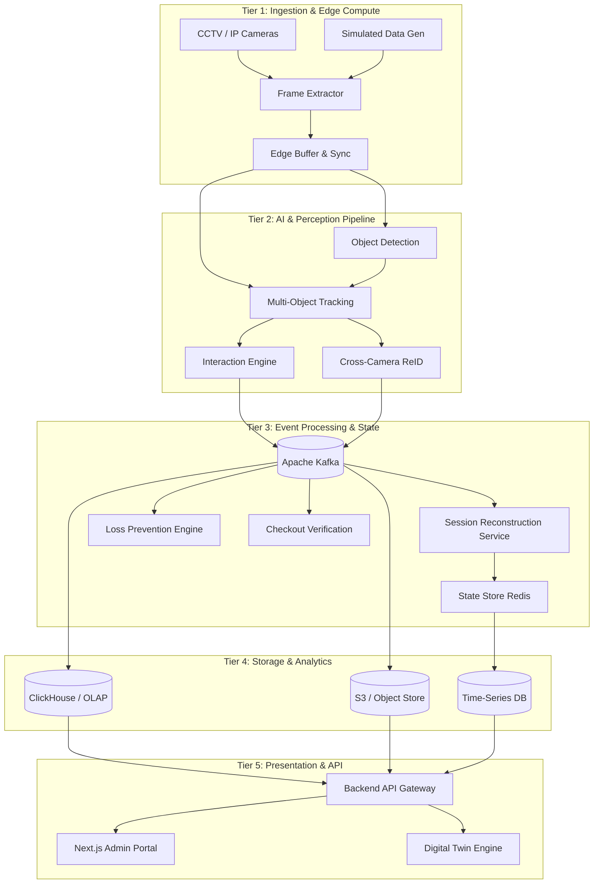

---

## 4. Input Modes & Media Ingestion Subsystem
### 4.1 Why This Subsystem Exists
A production retail system cannot rely on a single input method. During development, testing, and staging, engineers must use synthetic data, uploaded videos, and simulated RTSP streams. In production, stores use a mix of ONVIF-compliant IP cameras, legacy analog CCTV via DVRs, and occasionally direct USB webcams for pop-up displays. The ingestion layer abstracts this chaos into a unified, predictable stream of timestamped frames.

### 4.2 Architecture of the Ingestion Layer
We implement the "Producer-Consumer" pattern using a dedicated ingestion microservice per camera (or grouped cameras on edge hardware). 
*   **Protocol Handling:** We utilize FFmpeg wrapped in a Golang or Rust service. FFmpeg is chosen over GStreamer because it has superior cross-compilation support for edge ARM devices (NVIDIA Jetson), better hardware acceleration APIs (NVDEC/CUVID), and easier containerization without heavy library dependencies.
*   **Frame Buffering:** Video streams are bursty due to network jitter (especially over Wi-Fi cameras). We implement a circular buffer (Ring Buffer) in GPU memory (pinned memory via CUDA) to absorb jitter. The buffer size is dynamically calculated based on stream FPS and allowed latency (typically 500ms).
*   **Frame Synchronization:** Multi-camera tracking requires temporal alignment. Cameras drift due to NTP synchronization issues. The ingestion layer attaches a "capture timestamp" (based on the camera's internal clock, parsed from the RTSP RTP headers) and an "ingest timestamp" (based on the edge server's PTP-synchronized clock). 

### 4.3 Simulated & Synthetic Inputs
For testing, we build a "Virtual Camera Driver" that implements the same output interface as the RTSP driver. It reads pre-recorded MP4s or generates synthetic frames (e.g., using Unity or Blender rendering engines) and injects them into the pipeline at the specified FPS. This allows the exact same downstream CV pipeline to process both real and fake data, ensuring test parity.

### 4.4 Failure Scenarios & Production Considerations
*   **Camera Disconnect:** The ingestion service continuously pings the RTSP endpoint. If connection drops, it enters a "reconnection backoff" state (1s, 2s, 4s, max 30s) and emits a `CameraDisconnected` event to Kafka. It does not crash.
*   **Frame Dropping:** If the downstream CV pipeline cannot keep up, the ingestion layer must drop frames. It employs a "latest frame" strategy—if the buffer is full, the oldest frame is overwritten, ensuring the CV pipeline always processes the most recent state of the store, minimizing tracking lag.

---

## 5. Computer Vision Pipeline Requirements
This is the computational core of the platform. It transforms raw pixels into structured, semantic events. Designing this pipeline requires balancing inference speed, GPU memory constraints, and tracking accuracy.

### 5.1 Model Orchestration & GPU Scheduling
Running multiple models (Detection, Pose, ReID) sequentially on the same GPU is memory-inefficient and slow. 
*   **Approach:** We deploy NVIDIA Triton Inference Server on the edge node. Triton manages the GPU memory, allowing models to be loaded concurrently.
*   **Dynamic Batching:** Triton groups incoming frame requests into a single batch to maximize GPU utilization. However, in real-time video, waiting for a batch introduces latency. We configure a "max batch size" of 8 and a "dynamic batch delay" of 2ms. If 8 frames arrive in 2ms, they are batched; otherwise, whatever is available is processed immediately.
*   **Pipeline Parallelism:** Instead of running Frame N through Model A, then Model B, we use CUDA streams. While Model A processes Frame N+1, Model B processes Frame N. This hides latency.

### 5.2 Object Detection
*   **Task:** Identify bounding boxes for persons, shopping carts, baskets, hands, and products.
*   **Algorithm Comparison:**
    *   *YOLOv8/v9:* Extremely fast, low memory footprint. Excellent for persons and carts. Struggles with tiny objects (individual products on high shelves).
    *   *Faster R-CNN / Cascade R-CNN:* Higher accuracy on small objects, but too slow for real-time multi-camera edge processing.
    *   *DETR (Detection Transformer):* Excellent performance, eliminates need for Non-Maximum Suppression (NMS), but computationally heavy.
*   **Production Recommendation:** A hierarchical approach. We use a highly optimized YOLOv8-Pose model (quantized to INT8 via TensorRT) to find persons, carts, and hands. For shelf regions, we crop the frame based on the Digital Twin's shelf coordinates and run a secondary, lighter YOLO model fine-tuned strictly on retail products. If the secondary model fails, we fall back to a pure shelf-region density map (anonymized blob tracking).

### 5.3 Multi-Object Tracking (MOT)
*   **Task:** Associate bounding boxes across consecutive frames to create persistent tracklets (e.g., "Person 1 moved from X to Y").
*   **Algorithm Comparison:**
    *   *DeepSORT:* Uses Kalman Filters for motion prediction and a lightweight CNN for appearance features. Fails heavily in retail because people stop, turn around, or are occluded by shelves, causing the Kalman filter's velocity assumption to break.
    *   *ByteTrack:* Associates almost all bounding boxes, even low-confidence ones, in two passes. Excellent for crowded scenes, does not rely on appearance, but struggles when a person leaves a store and a different person wears the exact same colored shirt.
    *   *BoT-SORT (Bootstrapping MOT):* Combines ByteTrack's high-recall matching with Camera Motion Compensation (CMC) and an improved Kalman filter. 
*   **Production Recommendation:** BoT-SORT. We implement CMC using feature-matching (ECC algorithm) between consecutive frames to account for camera shake. We rely on IoU (Intersection over Union) for short-term matching, and embed appearance features (from a lightweight OSNet model) only when tracklets are broken by occlusion.

### 5.4 Cross-Camera Re-Identification (ReID)
*   **Task:** When "Person 1" leaves Camera A's Field of View (FoV) and enters Camera B's FoV, determine if it is the same person.
*   **The Retail ReID Problem:** Standard ReID assumes overlapping camera views. In retail, cameras are often placed on opposing walls looking down aisles, capturing the back of a person's head in one camera and their face/front in the next.
*   **Approach:** 
    1.  We do not rely solely on visual ReID. 
    2.  We use a Spatial-Temporal constraint engine. If Person A leaves Camera 1 at time $T$ moving East, and Person B appears in Camera 2 (which is East of Camera 1) at time $T + \Delta t$ (where $\Delta t$ matches walking speed based on store layout), we consider it a candidate match.
    3.  We then extract appearance embeddings using TransReID (Transformer-based ReID), which handles partial body occlusions (e.g., seeing only a shoulder) better than CNNs.
    4.  If the cosine similarity of the embeddings exceeds a dynamic threshold (calibrated per store based on lighting conditions), the identities are merged.

### 5.5 3D World Mapping & Camera Calibration
Bounding boxes are 2D. To know if a customer is "in Aisle 3" or "standing too close to the checkout," we need 3D world coordinates.
*   **Homography:** For top-down cameras, a simple homography matrix (mapping pixel space to floor space) works. We require store setup personnel to click four known floor points during camera configuration to generate this matrix.
*   **Perspective Correction & Ground Plane Estimation:** For angled cameras, we use a pinhole camera model. We estimate the ground plane using the detected floor boundaries and the camera's extrinsic parameters (height, pitch, roll).
*   **Distance Estimation:** Once we have the camera matrix and distortion coefficients, we can project the bottom-center pixel of a person's bounding box onto the ground plane to get $(X, Y, Z)$ coordinates in meters relative to the store's origin.
*   **Occlusion Handling:** If a person is behind a shelf, the 2D bounding box might shrink or disappear. We use the Digital Twin's 3D mesh to perform "occlusion reasoning." If we know a shelf is at $(X=5, Y=3)$, and a tracked person's trajectory predicts they are at $(X=5.1, Y=3.2)$, we keep their tracklet alive in a "ghost" state, predicting their exit point on the other side of the shelf using a short-term trajectory predictor (e.g., an LSTM or simple linear extrapolation).

### 5.6 Interaction & Session Reconstruction
This subsystem consumes tracklets, 3D coordinates, and hand detections to generate high-level retail events.
*   **State Machine for Products:** Every detected product on a shelf is in a state: `OnShelf`, `InHand`, `InCart`, `InBasket`, `Paid`, `Unpaid`.
*   **Hand-Object Interaction (HOI):** We calculate the Euclidean distance (in 3D world space, not pixels) between the detected hand keypoints (from YOLO-Pose) and the detected products. If distance $< 0.15$ meters for $> 3$ frames, we trigger a `ProductPickedUp` event.
*   **Return to Shelf:** If a product is in `InHand` state and the hand returns to the original shelf bounding box and the distance between hand and shelf increases (hand opens), we trigger `ProductReturned`.
*   **Transfer to Cart:** If a product is in `InHand` and the hand enters a cart/basket bounding box, we trigger `ProductAddedToCart`.
*   **Temporal Reasoning & Confidence:** We do not fire these events instantly. We maintain a sliding window of the last 15 frames. An event is only emitted if the state transition is consistent across $>70\%$ of the frames in the window. This prevents flickering events due to detection jitter.

### 5.7 Inference Optimization & Memory Management
Running 4-6 models per camera stream on an edge server (e.g., NVIDIA Jetson AGX Orin with 32GB shared memory) requires extreme optimization.
*   **Precision:** All models are converted to FP16 (Half Precision) using TensorRT. For YOLO models, we evaluate INT8 quantization using a calibration dataset specific to the store's lighting. If INT8 mAP drops $<1\%$, we deploy INT8; otherwise, we fall back to FP16.
*   **Frame Skipping:** We do not process 30 FPS for all models. Object detection runs at 15 FPS. Tracking runs at 30 FPS (using optical flow or IoU matching on the intermediate frames). Pose estimation runs at 10 FPS. The pipeline orchestrator routes frames to the correct models based on a scheduling cron.
*   **Memory Pooling:** To prevent CUDA out-of-memory errors and garbage collection stalls, we pre-allocate a fixed-size pool of GPU tensors at system startup. When a frame is ingested, it overwrites an existing tensor in the pool rather than calling `cudaMalloc`.

---
## 6. Digital Twin Subsystem
### 6.1 Why This Subsystem Exists
Computer vision models operate in a vacuum if they lack spatial context. A bounding box detecting a "person" at pixel coordinates $(400, 600)$ is meaningless without understanding that $(400, 600)$ corresponds to "Aisle 4, near the potato chips, inside the restricted employee zone." Hardcoding these mappings in configuration files fails when a store remodels, moves a display, or replaces a camera. The Digital Twin subsystem acts as the single source of truth for the physical geometry, topology, and metadata of the retail environment. It bridges the gap between 2D pixel space and 3D real-world logic.

### 6.2 Data Architecture & Scene Graph
The Digital Twin is not merely a visual rendering; it is a hierarchical spatial database. We model it as a Directed Acyclic Graph (DAG) known as a Scene Graph. Every object in the store is a node with a spatial transform (translation, rotation, scale) relative to its parent.

**Hierarchy Structure:**
*   `Store` (Root Node, Origin $0,0,0$ defined as the bottom-left corner of the sales floor)
    *   `Zone` (e.g., Sales Floor, Backroom, Entrance)
        *   `Aisle` (e.g., Aisle 3)
            *   `Fixture` (e.g., Gondola Shelf Unit #7)
                *   `Shelf` (e.g., Middle Shelf)
                    *   `Facing` (e.g., Slot 3, containing SKU #12345)
    *   `Infrastructure` (e.g., Walls, Pillars, Doors)
    *   `Sensors` (e.g., Cameras, BLE Beacons, Weight Sensors)

### 6.3 Schema Design for Spatial Entities
To support both the frontend editor and the backend CV pipeline, the schema must be strictly typed.
*   **Polygonal Boundaries:** Zones, aisles, and restricted areas are defined as 2D polygons (arrays of $[x, y]$ coordinates) mapped to the $Z=0$ (floor) plane.
*   **Volumetric Bounding Boxes:** Fixtures (shelves, freezers) are defined as 3D bounding boxes $(x_{min}, y_{min}, z_{min}, x_{max}, y_{max}, z_{max})$. This allows the CV pipeline to perform 3D frustum culling and occlusion reasoning.
*   **Metadata:** Every node supports arbitrary key-value metadata (e.g., `{"temperature_celsius": -18}` for a freezer, `{"max_weight_kg": 50}` for a shelf).

### 6.4 Digital Twin Builder UI (Frontend Architecture)
The admin portal contains a dedicated "Store Designer" module. 
*   **Rendering Engine:** We use React Three Fiber (R3F), a React renderer for Three.js. This allows us to embed a fully interactive 3D canvas directly inside the Next.js application, sharing state seamlessly via React hooks.
*   **Interaction Paradigm:** The default view is a top-down 2D orthographic projection, allowing users to draw floor plans easily (similar to Figma or floorplanner.com). Users can toggle to a 3D perspective view to validate camera placements and shelf heights.
*   **Object Manipulation:** Standard transform gizmos (translate, rotate, scale) are attached to selected objects. Snapping is implemented to ensure shelves align perfectly to aisles, and aisles align to grid increments (e.g., 0.5 meters).
*   **Component Library:** A sidebar contains draggable primitives (Wall segment, Standard Gondola, Cooler, Checkout Counter). When dropped, they instantiate the corresponding node in the Scene Graph.

### 6.5 Camera Placement & Coverage Estimation
This is a critical feature that turns the Digital Twin from a dumb diagram into an analytical tool.
*   **Frustum Visualization:** When a user places a camera node, they must input its height ($Z$), pitch (tilt angle), yaw (pan angle), and Field of View (FoV). The system renders a 3D frustum (a truncated pyramid) originating from the camera, visually showing exactly what the camera sees.
*   **Floor Coverage Calculation:** To calculate the exact square footage a camera covers, we project the 3D frustum onto the $Z=0$ floor plane, creating a 2D polygon. 
*   **Blind Spot Detection (Raycasting):** We implement a 2D Raycasting algorithm. Rays are cast from the camera's floor projection to the vertices of all shelving and wall polygons. If a region of the floor is not hit by any ray, it is marked as a blind spot. The UI renders these as red zones, prompting the user to add another camera or adjust the angle.
*   **Occlusion Zones:** Because cameras are not at infinite height, tall fixtures block the view of lower shelves. The system calculates "occlusion shadows" behind tall fixtures relative to the camera position and marks them as low-visibility zones.

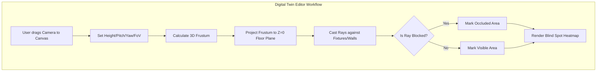

### 6.6 Version Control & Event Sourcing the Twin
Store layouts change. A promotional endcap is added for Christmas, then removed in January. If a theft event occurred on December 20th, investigating it in February requires viewing the store layout *as it existed on December 20th*, not the current layout.
*   **Twin as Event Sourced:** We do not `UPDATE` the digital twin in a database. Every change (e.g., `ShelfMoved`, `CameraPitchChanged`, `SKUAssignedToFacing`) is emitted as an immutable event to a specific Kafka topic (`twin.mutations`).
*   **State Snapshots:** To avoid replaying thousands of events to build the current state, the backend maintains a materialized view (snapshot) of the current Scene Graph in a JSON document store (MongoDB or PostgreSQL JSONB column). Every time a batch of mutations is processed, the snapshot is updated.
*   **Time-Travel Queries:** The API endpoint `GET /api/twin/{store_id}?timestamp=2023-12-20T14:00:00Z` fetches the snapshot closest to the requested time and replays only the subsequent mutations that occurred *before* the requested timestamp. This guarantees the CV engine and investigators can perfectly reconstruct the spatial context of any historical event.

### 6.7 Future IoT & Sensor Fusion Extensibility
The Scene Graph is designed to accommodate non-visual sensors.
*   **RFID Readers:** Modeled as nodes with a spherical bounding volume representing their read range. When an RFID tag is read, the system correlates it with the digital twin to know exactly which shelf the product is on.
*   **Weight Sensors:** Placed as child nodes of specific Shelves. A `WeightChanged` event is correlated with the CV pipeline's `ProductPickedUp` event to create a multi-modal "high confidence" pick event.
*   **BLE Beacons:** Placed at entrances and exits. They act as absolute ground-truth anchors for the CV tracking system, resetting any spatial drift that accumulates in the ReID or MOT algorithms.

---
## 7. Loss Prevention (LP) Engine
### 7.1 Why This Subsystem Exists
A naive approach to loss prevention—e.g., triggering an alarm whenever a product is picked up but not scanned at the POS—will generate thousands of false positives per day. False positives destroy the trust Loss Prevention (LP) agents have in the system, rendering it useless. True retail theft involves complex sequences of human behaviors: concealing items, distraction techniques, "sweethearting" (cashier collusion), and exploiting blind spots. The LP Engine must model this complexity. It is not a rule-based alerting system; it is a continuous, probabilistic state evaluator that treats theft as a evolving hypothesis supported or denied by a stream of observational evidence.

### 7.2 Core Architecture: The Suspicion Directed Acyclic Graph (DAG)
We reject flat scoring systems (e.g., $+10$ points for occlusion). Instead, we model potential theft scenarios as a DAG of behavioral nodes. Each node represents an observable event or a derived state. Paths through the DAG lead to specific theft hypotheses (e.g., "Concealment," "Basket Switching," "Sweethearting").

### 7.3 Event Taxonomy & Probabilistic Weighting
Every event emitted by the CV and Session Reconstruction pipelines is evaluated by the LP Engine. We assign conditional probabilities to these events based on their contribution to a theft hypothesis. 

*   **$E_1$: Product Picked Up.** Base probability of theft is low ($P(T) = 0.01$). This event transitions the item state but adds minimal suspicion.
*   **$E_2$: Severe Occlusion.** The customer's hands/torso enter a blind spot or are blocked by another person *while* holding an item. We apply Bayes' Theorem conceptually: $P(T | E_2)$ increases significantly because benign shoppers rarely hide behind shelves while holding merchandise.
*   **$E_3$: Hand-Object Disappears (Concealment).** Pose estimation tracks two hands. One hand holds a product. The hand bounding box intersects with a pocket, bag, or jacket opening bounding box, and the product bounding box disappears from the camera's view, but the hand re-emerges without the product. This is a high-confidence node ($P(T | E_3) > 0.7$).
*   **$E_4$: Item Transferred.** Person A hands an item to Person B. This is a known distraction/concealment tactic. The DAG branches to evaluate both persons.
*   **$E_5$: Shelf Replacement Mismatch.** A customer places an item back on a shelf, but the CV pipeline detects a different SKU color/shape than what was picked up (e.g., swapping a premium steak packaging for a cheap one). High suspicion of price-tag switching.
*   **$E_6$: Checkout Proximity & POS Sync.** The customer approaches the checkout. The LP engine listens to the `CheckoutVerification` stream. If the item is scanned, the theft hypothesis for that SKU is immediately terminated (probability reset to 0).
*   **$E_7$: Exit Gate Crossed.** The customer crosses the defined exit boundary in the Digital Twin.

### 7.4 Algorithmic Reasoning: From Events to Hypotheses
To avoid floating-point drift and ensure explainability, we use a Fuzzy Logic controller combined with a Hidden Markov Model (HMM).
*   **The HMM:** The hidden states are the true intentions of the customer (`Shopping`, `Concealing`, `Planning Exit`, `Theft`). The observations are our CV events ($E_1 \dots E_n$). The transition matrix is trained on historical loss prevention footage.
*   **Fuzzy Logic:** Instead of hard thresholds (e.g., "if occlusion > 5 seconds"), inputs are fuzzified. An occlusion of 5 seconds might be 0.6 "Suspicious" and 0.4 "Neutral". The fuzzy inference engine evaluates all rules and defuzzifies the output into a single `SuspicionScore` between 0.0 and 1.0 for that specific customer-session and SKU combination.

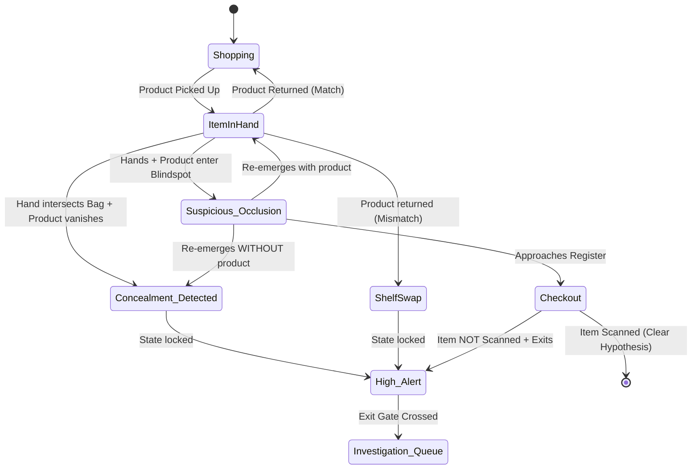

### 7.5 Advanced Theft Scenarios
The DAG must account for organized retail crime (ORC) and employee fraud.
*   **Sweethearting (Cashier Collusion):** The LP engine correlates the cashier's session with the customer's session. If the cashier passes items over the scanner without the characteristic "barcode presentation" angle detected by the CV, or if the system detects a "slide" motion (moving the item quickly across the pad without stopping for the laser), a `SuspectedSweethearting` event is generated, linking the Customer ID and Employee ID.
*   **Basket Switching / Pass-Back:** Customer A fills a basket. Customer B (accomplice) brings an empty basket. They cross paths in a blind spot. Customer B walks out with the full basket. The LP engine detects this via ReID: The basket's weight/visual density increased, but the person carrying it changed identities in an area with $<20\%$ camera coverage.
*   **Push-Outs:** A customer loads a cart and simply walks past the checkout. This is trivially detected by the Digital Twin geofence (Cart crossed `Zone: Checkout` without stopping for $> N$ seconds, then crossed `Zone: Exit`).

### 7.6 Investigation Workflow & Human-in-the-Loop
The AI does not accuse; it investigates. The output of the LP Engine is an `InvestigationTask` object pushed to an LP Agent's queue in the Next.js portal.
*   **Triage View:** Tasks are sorted by `SuspicionScore`. A score $> 0.85$ might trigger an SMS alert to on-site security. Scores between $0.5$ and $0.85$ go to the daily review queue.
*   **The Evidence Package:** When an agent clicks a task, the system dynamically generates an Evidence Package. It queries the Object Store (S3) for the raw video segments from all cameras that observed the customer during their session. It uses FFmpeg to stitch these into a single, synchronized, picture-in-picture video.
*   **Overlay Generation:** The replay video has a graphical overlay rendered via a headless browser (or Canvas API) showing the tracked customer (bounding box with ID), the suspected stolen SKU (bounding box highlighted in red), the timeline of events (text log on the side), and the accumulated suspicion score over time (a line graph in the corner).
*   **Verdict & Feedback Loop:** The agent must click `Confirmed Theft`, `False Positive`, or `Inconclusive`. 
    *   If `False Positive`, the system logs which nodes in the DAG contributed to the error. If a specific "Occlusion" rule consistently leads to false positives, an MLOps pipeline flags this for the LP data science team to adjust the transition weights in the HMM.
    *   If `Confirmed Theft`, the video, the DAG state, and the agent's digital signature are cryptographically hashed and written to a WORM (Write Once Read Many) storage bucket to ensure legal admissibility and prevent tampering.

### 7.7 Production Considerations & Privacy
*   **Face Blurring:** By default, all Evidence Package videos are processed through a lightweight face detection model (e.g., RetinaFace) and blurred. The LP agent does not need to see the face to observe the *action* of theft. Faces are only unblurred if the store manager (a higher RBAC tier) explicitly authorizes it for prosecution purposes, an action which is heavily audit-logged.
*   **Bias Mitigation:** The tracking and pose estimation models must be evaluated across diverse demographics. If the occlusion reasoning inherently penalizes clothing styles that happen to have larger silhouettes (which might trigger false "concealment" detections), the fuzzy logic thresholds must be calibrated to prevent demographic bias in suspicion scores. This is a continuous, mandated testing requirement.

---
## 8. Checkout Verification Engine
### 8.1 Why This Subsystem Exists
While the Loss Prevention engine focuses on malicious intent, the Checkout Verification engine focuses on *process integrity*. Industry data shows that a massive percentage of retail shrinkage is caused by process failures rather than outright theft: cashiers accidentally skipping an item, barcode scanners failing to read damaged labels, customers at self-checkout intentionally or unintentionally bypassing the scanner (skip-scanning), or "sweethearting" where a cashier knowingly fails to scan items for a friend. This engine acts as an independent, silent auditor that compares the physical reality (observed by cameras) against the digital record (generated by the Point of Sale system).

### 8.2 The Core Problem: Asynchronous Stream Synchronization
The fundamental engineering challenge of checkout verification is that the Vision Stream and the POS Stream are completely asynchronous and operate at different latencies.
*   **POS Stream:** Event-driven. A barcode is scanned, generating a `POS_ItemScanned` event with near-zero latency. However, manual lookups, voids, or coupon applications create unpredictable pauses.
*   **Vision Stream:** Continuous state estimation. The CV pipeline outputs a continuous list of items currently in the cart, on the belt, or in the bagging area. It takes time (latency) for the CV pipeline to register that an item has moved from the cart to the belt, and more time to recognize the SKU.

Because of this, we cannot simply take a snapshot of the CV cart state at the exact millisecond a POS event occurs. We must employ a **Sliding Window Sequence Alignment** algorithm.

### 8.3 System Integration & POS Ingestion
To perform verification, the platform must ingest real-time POS data.
*   **Integration Methods:** For modern POS systems (NCR, Toshiba, Square), we integrate via Webhooks or direct WebSocket connections to the POS middleware. For legacy systems, we tap into the pole display serial output or the receipt printer data stream using a small hardware dongle (e.g., a Raspberry Pi) that parses the ESC/POS printer commands and emits structured JSON events to our Kafka cluster.
*   **POS Event Schema:** We normalize all POS data into a standard `TransactionEvent` schema:
    ```json
    {
      "transaction_id": "txn_8834A",
      "store_id": "store_01",
      "register_id": "reg_03",
      "timestamp": "2023-10-27T14:32:11.004Z",
      "event_type": "ITEM_SCANNED", // ITEM_VOIDED, PAYMENT_STARTED, TRANSACTION_COMPLETE
      "sku": "SKU_12345",
      "description": "Organic Milk 1L",
      "price_cents": 450,
      "operator_id": "emp_402" // null for self-checkout
    }
    ```

### 8.4 The Verification Algorithm: Dynamic Time Warping (DTW)
We treat the checkout process as two time-series sequences that need to be aligned.
*   **Sequence A (Vision):** An array of state changes. `[Item_X moved to belt, Item_Y moved to belt, Item_X moved to bag, Item_Y moved to bag]`
*   **Sequence B (POS):** An array of scan events. `[SKU_X scanned, SKU_Y scanned]`

We use a modified Dynamic Time Warping (DTW) algorithm. Standard DTW finds the optimal match between two sequences allowing for stretching or compressing in time. 
*   **How it works:** When the CV system detects `Item_X` on the belt, it opens a "matching window" of $\pm 5$ seconds. If `SKU_X` appears in the POS stream within that window, they are linked. 
*   **Handling Voids:** If `SKU_X` is scanned, but 2 seconds later a `VOID` event occurs for `SKU_X`, the DTW algorithm removes that link and looks for the next corresponding vision event.
*   **Handling Multi-packs:** If the POS records a single scan for "6-Pack Soda," but the CV system tracks 6 individual items being moved, the system queries the Product Information Management (PIM) database. If the PIM states that SKU_X is a multi-pack containing 6 units, the DTW algorithm maps the 1 POS event to the 6 Vision events, clearing the discrepancy.

### 8.5 Handling Complex Scenarios
*   **Manual Overrides (Keyed SKUs):** If a barcode fails to scan, the cashier manually types the SKU or searches by name. This introduces high latency. The CV engine must keep the "unmatched vision items" in a pending buffer for up to 15 seconds to allow for slow manual POS entries.
*   **Self-Checkout "Pass-Back" Fraud:** At self-checkout, a common fraud tactic is scanning a cheap item (e.g., bananas) while bagging an expensive item (e.g., steak). The Checkout Verification engine uses 3D spatial reasoning from the Digital Twin. It defines a "Scanning Zone" bounding box. If a `POS_ItemScanned` event occurs, but the CV system observes that the item placed in the bagging area *originated from outside the Scanning Zone* (e.g., pulled directly from the cart to the bag), a `SuspectedPassBack` alert is generated and routed directly to the LP Engine.
*   **The "Settling Time" Problem:** A customer might pay, but still be putting the last item in their cart. We define a "Settle Delay" (e.g., 10 seconds after `TRANSACTION_COMPLETE`). The final reconciliation does not occur until this window closes.

### 8.6 Discrepancy Resolution & Output
At the end of a transaction, the engine outputs a `TransactionAuditReport`:
*   **Status:** `MATCH`, `MINOR_DISCREPANCY`, `MAJOR_DISCREPANCY`.
*   **Unscanned Items (Vision -> POS Miss):** Items the CV system observed leaving the store that have no corresponding POS scan. This is the primary shrinkage metric.
*   **Ghost Scans (POS -> Vision Miss):** Items scanned at the POS but not observed by CV. This often indicates a barcode stuck to a cashier's sleeve, a fake scan, or simply a CV model failure to detect a small/barcode-only item.

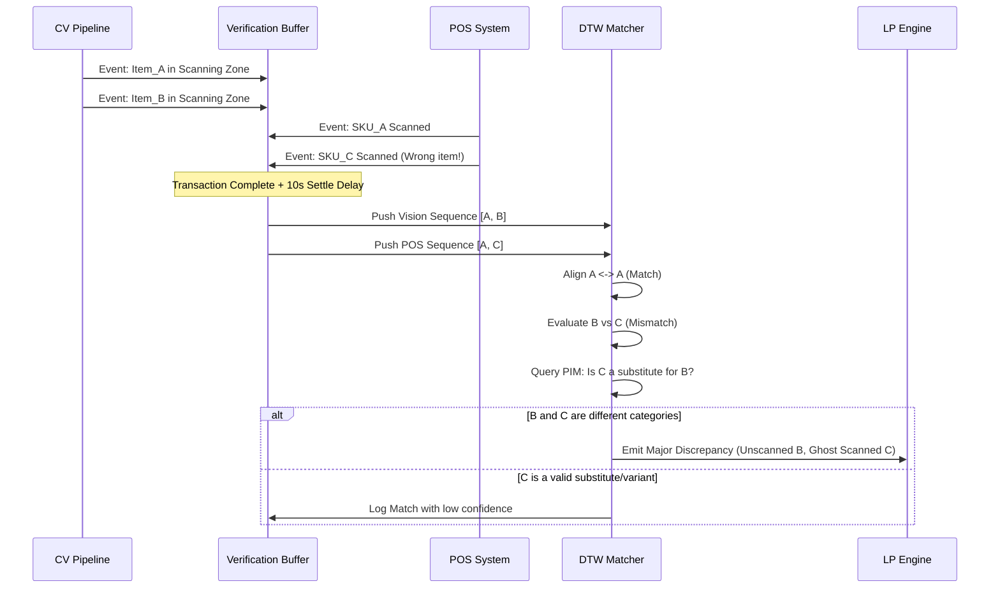

### 8.7 Future Smart Checkout Integration
Currently, this system audits traditional checkouts. In the future roadmap, this engine *becomes* the checkout. In an AI-powered "Just Walk Out" paradigm, the `POS_Stream` is entirely replaced by the `CV_Session_Reconstruction_Stream`. The algorithm remains identical: we simply replace the barcode scan events with high-confidence CV SKU recognition events, and the payment is triggered automatically upon crossing the Digital Twin's exit geofence. Designing the Verification Engine as an independent, pluggable module now ensures a seamless transition to autonomous checkout later.

---
## 9. Event-Driven Architecture
### 9.1 Why This Subsystem Exists
In a monolithic application, module A simply calls a function in module B. In a distributed system processing millions of data points per minute across dozens of microservices, synchronous communication creates tight coupling, cascading failures, and insurmountable latency. If the Loss Prevention engine takes 500ms to evaluate a theft hypothesis, it must not block the Computer Vision pipeline from processing the next video frame. The Event-Driven Architecture (EDA) acts as the central nervous system, decoupling services while ensuring that every piece of state change is immutably recorded, strictly ordered, and reliably delivered.

### 9.2 Technology Selection: Apache Kafka & Redis Streams
We do not use a single message broker for all use cases; we segment by latency and durability requirements.
*   **Apache Kafka (Cloud Cluster):** Used as the system of record for all domain events (e.g., `ProductPickedUp`, `TransactionCompleted`). Kafka provides durable, replicated storage, allowing us to retain events for weeks and replay them to build new microservices or train machine learning models without modifying upstream producers.
*   **Redis Streams (Edge Nodes):** Used on the edge hardware (inside the store) for ultra-low-latency inter-process communication (e.g., between the Frame Extractor process and the Tracking process). Redis Streams operates in memory with sub-millisecond latency. A lightweight "edge bridge" microservice periodically drains the Redis Stream and batches the events into Kafka for cloud persistence.

### 9.3 The Outbox Pattern
A critical failure mode in distributed systems is the "dual-write" problem: a service updates its local database and emits a Kafka event. If the database commits but the Kafka publish fails, the systems desync. We strictly mandate the **Transactional Outbox Pattern**.
*   Services never publish directly to Kafka. Instead, they write the event payload into a local `outbox` table within the same database transaction as their business logic state change.
*   We deploy Debezium (a Change Data Capture tool) as a Kafka Connect connector. Debezium reads the transaction logs of the local databases (PostgreSQL/MySQL), detects new rows in the `outbox` tables, translates them to Kafka messages, and publishes them.
*   This guarantees that an event is published if and only if the local state was successfully persisted.

### 9.4 Event Taxonomy & Topic Design
Kafka topics are named using the format: `<domain>.<entity>.<event-type>`. We avoid putting all events into a single "omnibus" topic to prevent consumer bottlenecks.

*   `vision.tracking.tracklet-updated` (High volume, ~30 msgs/sec per camera)
*   `vision.interaction.product-picked-up` (Medium volume)
*   `retail.pos.transaction-event` (Low volume, bursty)
*   `twin.mutations.layout-changed` (Very low volume)
*   `lp.engine.hypothesis-updated` (Low volume)

### 9.5 Event Schema & Versioning
To prevent brittle JSON parsing, all events are serialized using **Protocol Buffers (Protobuf)**. Protobuf provides strict typing, backward/forward compatibility, and significantly smaller payload sizes compared to JSON, reducing network I/O and Kafka storage costs.
*   **Schema Registry:** We run a Confluent Schema Registry. A producer cannot publish a message to Kafka unless the schema is registered and passes compatibility checks.
*   **Evolution Strategy:** We use `IGNORE_DELETED_FIELDS` and `IGNORE_ADDED_FIELDS` (forward and backward compatibility). If we need to rename a field, we must add a new field, deprecate the old one, and increment the schema version. Consumers are version-aware and route to the correct Protobuf parser based on the schema ID embedded in the Kafka message header.

### 9.6 Event Identity & Idempotency
Network retries and Kafka consumer restarts can cause an event to be processed more than once. Processing a `PaymentCompleted` event twice would be catastrophic.
*   **Event IDs:** Every event contains an `id` field generated using **UUIDv7**. Unlike UUIDv4 (random), UUIDv7 is time-ordered. The first 48 bits are a Unix timestamp in milliseconds. This means UUIDs are naturally sortable by generation time, which is a massive advantage for database indexing and event replay ordering.
*   **Idempotency Keys:** Every stateful consumer maintains a deduplication cache (stored in Redis with a 24-hour TTL). Before processing an event, the consumer checks if the `event_id` exists in the Redis set. If it does, the event is acknowledged but discarded.

### 9.7 Ordering Guarantees & Partitioning
Kafka only guarantees ordering of events *within a single partition*. If a customer picks up item A, then item B, we must ensure the LP engine processes A before B.
*   **Partition Keys:** We do not partition by `store_id` (this creates a "hot partition" for busy stores). For business logic events, the Kafka partition key is strictly the `session_id` (the unique identifier of the customer's shopping trip). This ensures that all events for a specific customer are processed sequentially by a single consumer instance.
*   **Vision Telemetry Exception:** For raw tracking telemetry (`tracklet-updated`), the volume is too high to partition by session. We partition by `camera_id`. The downstream Session Reconstruction service is designed to handle out-of-order tracking updates from different cameras using event timestamps and buffer windows.

### 9.8 Dead Letter Queues (DLQ) & Retry Strategies
If a consumer encounters an unexpected error (e.g., a database constraint violation, a corrupted Protobuf payload, or a null pointer exception), it must not infinitely retry and block the partition.
*   **Retry Strategy:** We implement a staged retry. The consumer catches the exception, pauses for 1 second, and tries again (handling transient network glitches). If it fails 3 times, it stops retrying, commits the offset (so the partition moves forward), and publishes the original event to a Dead Letter Queue topic (e.g., `vision.interaction.product-picked-up.dlq`).
*   **DLQ Monitoring:** The DLQ topics have strict retention policies (e.g., 7 days) and are heavily monitored. An alert triggers if any DLQ receives more than 10 messages in 5 minutes, indicating a systemic bug or schema incompatibility that requires developer intervention.

### 9.9 Snapshots & State Rehydration
Event sourcing creates a challenge: to know the *current* state of a shopping session (e.g., "What items are currently in the customer's cart?"), we would theoretically have to replay all `ProductPickedUp` and `ProductReturned` events since the customer entered the store. This is too slow for real-time queries.
*   **Periodic Snapshots:** The Session Reconstruction service maintains an in-memory state store. Every 5 seconds, or whenever a significant state change occurs (e.g., checkout completed), it serializes the current state of the session to a Redis hash (`session:{session_id}:snapshot`).
*   **Rehydration:** When a service needs the current state, it reads the latest snapshot from Redis, and then only replays the events that occurred *after* the snapshot timestamp (which are a tiny, manageable subset stored in a short-term Redis Stream buffer).

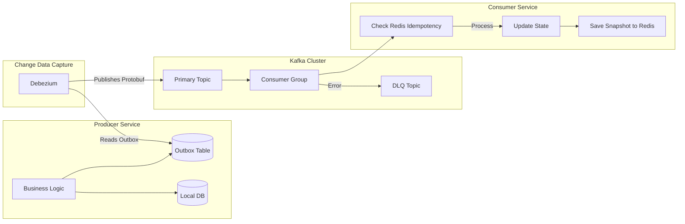

---
## 10. Database Design
### 10.1 Why This Subsystem Exists
A fundamental mistake junior architects make in event-driven systems is attempting to force all data into a single database technology—usually PostgreSQL—because it is familiar. In a system generating thousands of CV tracking events per second, storing terabytes of video blobs, requiring sub-millisecond vector similarity searches for ReID, and serving complex analytical dashboards, a single database will catastrophically fail under load. We must employ **Polyglot Persistence**: using different database technologies optimized for specific data access patterns, connected logically via the event bus.

### 10.2 Relational Database: PostgreSQL
**Purpose:** The system of record for transactional data, configuration, user management, and the Digital Twin snapshot state. PostgreSQL is chosen for its strict ACID compliance, JSONB capabilities, and the PostGIS extension, which is mandatory for our spatial/geometric queries.

**Key Schemas & Tables:**
*   `identity.users` & `identity.tenants`: Standard RBAC tables. Multi-tenancy is implemented at the schema level (one schema per enterprise customer) or row-level security (RLS) for multi-store isolation.
*   `retail.stores` & `retail.inventory`: Master data. 
*   `twin.store_layouts`: Stores the JSON snapshot of the Scene Graph.
    *   *Indexes:* GIN indexes on the JSONB column to allow rapid querying (e.g., "Find all stores that contain a freezer").
*   `twin.spatial_objects`: Stores polygons and bounding boxes using PostGIS `geometry` types.
    *   *Why PostGIS?* To answer queries like: "Given a point $(X, Y)$ from the CV pipeline, which aisle polygon does it intersect?" PostGIS handles this math natively via spatial R-Tree indexes, which would be agonizingly slow to compute in application code.

**Tradeoffs & Production Considerations:**
PostgreSQL scales vertically. We will not run massive analytical queries against this database. Connection pooling via PgBouncer is strictly mandated to prevent connection exhaustion during traffic spikes.

### 10.3 Analytical Database: ClickHouse
**Purpose:** The engine powering the Next.js analytics dashboards, heatmaps, and historical reporting. ClickHouse is an open-source Columnar OLAP database. It processes aggregation queries over billions of rows orders of magnitude faster than PostgreSQL.

**Data Ingestion:**
ClickHouse acts as a consumer to our Kafka topics. It ingests the raw Protobuf events, deserializes them, and writes them to disk.
**Table Engine Design:**
We use the `ReplacingMergeTree` engine. Because events can be retried and re-processed (despite idempotency checks), we might receive duplicate events with the same UUID. This engine automatically deduplicates rows during background merges based on the `event_id` primary key, keeping only the latest version.

**Schema Example (`analytics.vision_events`):**
*   `event_date` (Date): Used for partitioning.
*   `event_time` (DateTime64(3, 'UTC')): Millisecond precision.
*   `store_id` (String)
*   `camera_id` (String)
*   `session_id` (String)
*   `event_type` (LowCardinality(String)): E.g., 'PICKUP', 'RETURN'. ClickHouse optimizes LowCardinality columns via dictionary encoding.
*   `sku` (Nullable(String))
*   `confidence` (Float32)
*   `world_x`, `world_y` (Float64): Real-world coordinates.

**Partitioning & Indexes:**
Partitioned by month (`toYYYYMM(event_date)`). Ordered by `(store_id, session_id, event_time)`. This ordering ensures that when querying a specific customer's session timeline, the database reads a contiguous block of data on disk, minimizing I/O.

**Materialized Views:**
We do not calculate heatmaps on the fly. We create ClickHouse Materialized Views that trigger *as data is inserted*. For example, an `analytics.heatmap_grid` table automatically aggregates `world_x, world_y` into 0.5x0.5 meter grid cells every hour, storing the count of people. The frontend queries this pre-calculated grid, resulting in sub-50ms dashboard loads.

### 10.4 Time-Series Database: TimescaleDB
**Purpose:** While ClickHouse handles *business* events, we need a dedicated database for *infrastructure* metrics: GPU temperature, inference latency p99, Kafka consumer lag, dropped frames, and CPU utilization. 
**Why TimescaleDB over InfluxDB?** TimescaleDB is built on PostgreSQL. This means our DevOps and backend teams do not need to learn a new query language or manage a separate cluster; it runs as an extension inside our existing PostgreSQL infrastructure.
**Hypertables:** Metric tables are converted to Hypertables, automatically partitioned by time. We configure aggressive retention policies: high-resolution data (1-second intervals) is kept for 7 days; downsampled data (5-minute averages) is kept for 1 year.

### 10.5 Object Storage: MinIO (S3 Compatible)
**Purpose:** Storage of video clips, evidence packages, ML model artifacts (ONNX/TensorRT files), and exported reports. Storing blobs in a database destroys performance and makes backups impossible.
**Architecture:** We deploy MinIO in a distributed, erasure-coded configuration across multiple nodes. This provides S3 API compatibility while keeping data on-premise or in a private VPC, which is a strict requirement for many enterprise retailers due to privacy/GDPR concerns regarding video footage.
**Storage Structure:**
Buckets are structured logically: `raw-footage-{store_id}`, `evidence-pkgs`, `ml-artifacts`.
**Lifecycle Management:** Raw video is extremely expensive to store. We implement S3 Lifecycle Rules: video segments are transitioned to a "cold" storage tier (e.g., AWS S3 Glacier or local tape backup) after 14 days, and permanently deleted after 90 days, unless flagged as an active LP investigation (which adds a legal-hold metadata tag, pausing deletion).

### 10.6 Vector Database: Qdrant
**Purpose:** Powering the Cross-Camera ReID subsystem. When a person leaves Camera A's field of view, we must quickly find if their appearance vector matches any active tracklets in Camera B. 
**Why Qdrant over pgvector?** While PostgreSQL's `pgvector` is convenient, it relies on exact KNN (K-Nearest Neighbors) search, which scans the entire table. At 100+ active tracklets per store across 500 stores, querying pgvector introduces unacceptable latency (>50ms). Qdrant uses the HNSW (Hierarchical Navigable Small World) algorithm for Approximate Nearest Neighbor (ANN) search, returning results in <5ms with 99% accuracy.
**Collections:**
*   `active_tracklets`: Stores 512-dimensional OSNet embeddings. Payloads include `session_id`, `camera_id`, and `last_seen_timestamp`. We configure a TTL (Time-To-Live) in Qdrant; if a tracklet is not updated within 60 seconds, the vector is automatically dropped, preventing index bloat.
*   `product_catalog`: Stores CLIP (Contrastive Language-Image Pretraining) embeddings of product images. This allows a future feature where a manager can upload a photo of a competitor's product, and the system vector-searches the store's catalog to find the closest visual match.

### 10.7 Cache: Redis
**Purpose:** The operational memory of the system. Used for idempotency tracking (as discussed in EDA), session state snapshots, rate limiting, and distributed locks (e.g., ensuring only one edge node attempts to retrain a model at a time).

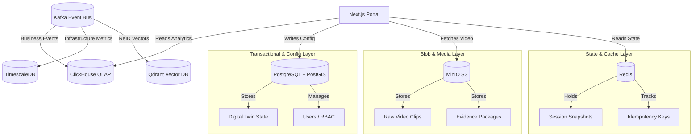

---
## 11. Next.js Admin Portal
### 11.1 Why This Subsystem Exists
The backend infrastructure processes millions of events, but this data is useless if store managers, LP agents, and enterprise executives cannot intuitively consume it. The Admin Portal is not a simple CRUD interface; it is a high-performance, real-time operational command center. It must render complex 3D environments, play synchronized multi-angle video feeds, display live updating metrics, and provide investigative tools—all while remaining responsive under heavy data loads. We choose Next.js (App Router) for its React Server Components (RSC) architecture, which drastically reduces the client-side JavaScript bundle by serving pre-rendered dashboard shells, while allowing client-side boundaries for highly interactive components like the Digital Twin and Video Player.

### 11.2 Routing, Multi-Tenancy, & White-Labeling
The URL structure inherently defines the data isolation boundary: `app/[tenantSlug]/[storeId]/[...routes]`.
*   **Middleware Authentication:** Next.js Middleware runs at the edge before any page renders. It validates the JWT token (via a lightweight JWKS fetch to the auth provider) and injects the `tenant_id` and `store_id` into the request headers. If a user attempts to access a store ID they do not have RBAC permissions for, the middleware instantly redirects them, preventing unauthorized data fetching.
*   **White-Labeling:** We implement a dynamic theme registry. The `[tenantSlug]` triggers a database lookup (cached at the edge using Vercel Edge Config or Redis) that returns the tenant's brand colors, logo URLs, and custom CSS variables. These are injected into the root layout's `<style>` tag, ensuring the entire application visually transforms instantly based on the URL.

### 11.3 The Dashboard Ecosystem
We do not build a single cluttered dashboard. We build distinct, focused views tailored to specific user personas.
*   **Executive Dashboard:** Pure Server-Side Rendering (SSR). Queries ClickHouse for aggregate metrics (total revenue vs. shrinkage, YoY comparisons). Uses Recharts or Tremor for static charts. Zero WebSockets to minimize client load.
*   **Operations Dashboard:** Live view of store health. Displays camera uptime (green/yellow/red dots), queue lengths at registers, and current foot traffic. Subscribes to a Kafka-to-WebSocket bridge for real-time updates.
*   **Security (LP) Dashboard:** The triage queue for the Loss Prevention Engine. Displays a list of `InvestigationTask` objects sorted by severity. Includes an embedded mini-player for the evidence clip.
*   **AI Dashboard:** Monitors the perception pipeline. Displays inference latency (p50, p99), dropped frames per camera, model confidence distributions (histograms), and GPU memory utilization. Critical for ML engineers to detect model drift.
*   **Inventory Dashboard:** Cross-references the PIM (Product Information Management) database with CV-derived shelf occupancy. Highlights "Out of Stock" (OOS) events detected by vision before the POS system registers a sale.

### 11.4 Digital Twin Visualization (3D Engine)
This is the most computationally intensive frontend component.
*   **Architecture:** We use React Three Fiber (R3F) wrapped in a React Client Component boundary. The Digital Twin state (the Scene Graph JSON) is fetched via TanStack Query and passed into R3F as a context.
*   **Rendering the Store:** Walls and fixtures are rendered as simple CSG (Constructive Solid Geometry) boxes to keep the polygon count near zero, ensuring 60 FPS on low-end store manager laptops.
*   **Live Tracking Overlay:** A WebSocket connection pushes `tracklet-updated` events (filtered by store ID). We maintain a `Zustand` store for live tracking data. In the R3F render loop, we iterate over active tracklets and render colored spheres at their $(X, Z)$ world coordinates. To prevent UI thread blocking when 50 people are in the store, we offload the coordinate-to-3D-matrix math to a Web Worker.
*   **Heatmap Overlay:** When a user enables the heatmap view, the frontend fetches the pre-aggregated grid from the ClickHouse Materialized View. We map the grid values to a color gradient (green -> yellow -> red) and render them as semi-transparent textured planes floating slightly above the floor mesh.

### 11.5 The Investigation & Replay System
This is the core tool for LP agents and requires flawless A/V synchronization.
*   **The Problem:** Standard HTML5 `<video>` tags drift out of sync when playing multiple streams. If Camera A shows a customer picking up an item, and Camera B shows them concealing it, a 200ms desync makes the evidence confusing.
*   **The Solution:** We build a custom React player using the `HTMLMediaElement` API. We designate one video (usually the camera with the clearest view of the action) as the "Master Clock." Every 100ms, via `requestAnimationFrame`, we read the `currentTime` of the master video. We then calculate the `delta` between the master's timeline and the other cameras' timelines (based on the NTP-synchronized ingest timestamps stored in S3 metadata). If a secondary video drifts by more than 50ms, we programmatically adjust its `playbackRate` (e.g., speed up to 1.1x or slow to 0.9x) temporarily to nudge it back into perfect sync, returning to 1.0x once aligned.
*   **Timeline Scrubbing:** Below the video grid is a custom SVG timeline. We render markers for every extracted CV event (`PickedUp`, `Occluded`, etc.). Scrubbing this timeline instantly seeks all video players and updates a side panel showing the exact state of the customer's cart at that millisecond.

### 11.6 Live Camera Wall
Displaying a 4x4 grid of live camera feeds in a browser is non-trivial.
*   **Protocol Selection:** We evaluate WebRTC, HLS, and MJPEG.
    *   *HLS (HTTP Live Streaming):* 5-10 second latency. Unacceptable for security monitoring.
    *   *WebRTC:* Sub-second latency, but requires a signaling server (SFU) and is extremely CPU/Bandwidth intensive to maintain 16 peer connections per browser tab.
    *   *MJPEG (Motion JPEG over HTTP):* ~200ms latency. Very low CPU overhead on the client (just decoding JPEG frames). High bandwidth, but acceptable on internal retail networks.
*   **Production Choice:** We use MJPEG for the "Camera Wall" overview grid. When an agent double-clicks a camera to go "full screen," we dynamically tear down the MJPEG stream and establish a WebRTC peer connection to get sub-100ms latency for active investigation.

### 11.7 Advanced Features: NL Analytics & Notifications
*   **Natural Language Analytics:** We integrate an LLM (e.g., GPT-4o or a local Llama-3 model) via a secure backend proxy. The frontend provides a chat interface. When a user asks: *"Why did shrinkage increase in Aisle 4 last week?"*, the frontend sends the query to the backend. The backend converts this to a ClickHouse SQL query (via LangChain's SQL Agent), executes it, and streams the answer *along with the generated ECharts/Recharts configuration* back to the frontend. The frontend dynamically renders the chart.
*   **Alert Center & Notification:** Uses the browser `Notification API` (after explicit user opt-in) coupled with a WebSocket heartbeat. If an `InvestigationTask` with high severity is created, the WebSocket pushes a payload that triggers a native OS desktop notification, even if the browser tab is in the background.

### 11.8 Frontend Performance & Accessibility
*   **Virtualization:** Lists like "Audit Logs" or "10,000 SKUs" must use `@tanstack/react-virtual`. Rendering 10,000 DOM rows will freeze the browser.
*   **Dark Mode:** Implemented natively using Tailwind's `dark:` variant. We read the user's OS preference via `prefers-color-scheme` but allow a manual toggle stored in `localStorage`. We do *not* use CSS-in-JS for theming, as it increases bundle size and destroys SSR performance.
*   **Accessibility (a11y):** The application must meet WCAG 2.1 AA standards. All charts must have `aria-label` descriptions generated from the data payload. The 3D Digital Twin is inherently inaccessible to screen readers; therefore, we provide a hidden, parallel semantic HTML summary table that updates as the user interacts with the 3D scene, ensuring screen readers can convey spatial data.

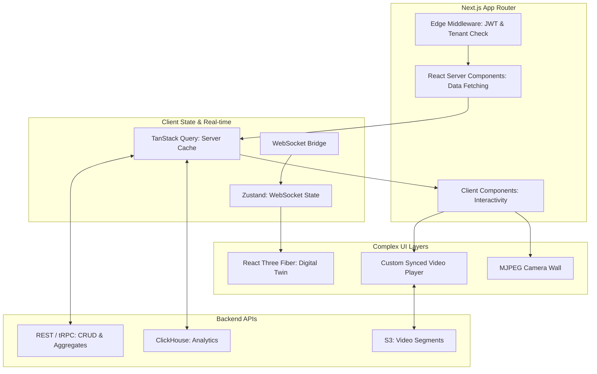

---
## 12. Testing Framework
### 12.1 Why This Subsystem Exists
Testing a distributed, event-sourced computer vision system is fundamentally different from testing a traditional CRUD web application. In a CRUD app, given input X, you expect database state Y. In our platform, given a 10-minute video of a crowded store, the output is millions of tracking coordinates, thousands of probabilistic events, and dozens of derived hypotheses. Small changes—such as a 1% drop in object detection confidence due to a TensorRT optimization—can cascade through the tracking and session reconstruction layers, resulting in a completely different Loss Prevention outcome. Traditional unit tests are utterly insufficient. We require a comprehensive, multi-layered testing framework that validates mathematical determinism, system resilience, and behavioral regression across the entire stack.

### 12.2 The Determinism Problem & Golden Datasets
Machine learning models are inherently stochastic (due to GPU non-determinism in floating-point operations). To create a reliable test suite, we must establish "Golden Datasets."
*   **Dataset Curation:** We maintain a proprietary vault of ~2,000 video clips (~500 hours) stored in MinIO. These clips are exhaustively manually annotated with ground-truth bounding boxes, tracklet IDs, SKU interactions, and checkout timestamps using tools like CVAT (Computer Vision Annotation Tool).
*   **Forcing Determinism:** During CI/CD pipeline runs, we configure the inference engine (Triton/NVIDIA runtime) to execute in strict deterministic mode (`CUBLAS_WORKSPACE_CONFIG=:4096:8` and `torch.use_deterministic_algorithms(True)`). This sacrifices a tiny amount of inference speed (~2-3%) to ensure that the exact same video produces the exact same floating-point outputs every single time.
*   **Event Vector Comparison:** We do not compare raw pixels. We run the Golden Dataset through the pipeline and capture the emitted Kafka events (e.g., `ProductPickedUp` at timestamp $T$ with confidence $C$). The test harness compares the CI output against the Golden Event Vector. We implement a "fuzzy matcher" that allows for temporal jitter (e.g., a pick-up event is considered a match if it occurs within $\pm 500$ms of the ground truth) and minor confidence variances ($\pm 0.02$).

### 12.3 Synthetic Data Generation Engine (The "Matrix")
Relying solely on real video is slow and does not cover edge cases (e.g., a customer climbing a shelf, a store evacuation). We build a Synthetic Data Engine to generate infinite, perfectly labeled test scenarios.
*   **3D Simulation:** We integrate with Blender or Unity, feeding them the Digital Twin JSON (walls, shelves, exact dimensions). We populate the 3D scene with rigged human avatars and product meshes.
*   **Scripted Trajectories:** A test scenario is defined as a Python DSL (Domain Specific Language):
    ```text
    GIVEN store_layout "Store_01"
    SPAWN customer "Alice" at entrance
    MOVE "Alice" to Aisle_3 via path [waypoint1, waypoint2]
    INTERACT "Alice" picks SKU_12345 from Shelf_4_Slot_2
    OCCLUDE "Alice" behind Fixture_7 for 5 seconds
    MOVE "Alice" to Exit
    ```
*   **Photorealistic Rendering:** The engine renders the scenario from the exact camera positions defined in the Digital Twin, applying domain randomization (changing lighting conditions, adding sensor noise, altering textures) to ensure the CV models do not overfit to the synthetic graphics.
*   **Perfect Ground Truth:** Because we control the simulation, the test framework *already knows* the exact 3D coordinates, timestamps, and SKUs involved, generating the Golden Event Vector automatically without human annotation.

### 12.4 Event Injection & Downstream Behavioral Testing
Often, we do not need to test the CV pipeline at all; we need to test the business logic (LP Engine, Checkout Verification). We build an "Event Injector" service that connects directly to Kafka, bypassing the video ingestion entirely.
*   **Synthetic Billing:** The injector rapidly fires a sequence of POS events (`ITEM_SCANNED`, `PAYMENT_COMPLETED`) mixed with Vision events (`ITEM_IN_CART`, `ITEM_PAID`) containing deliberate anomalies (e.g., an item in the cart that was never scanned).
*   **LP Hypothesis Testing:** We inject a sequence of events that perfectly mimics a "Sweethearting" scenario. We then assert that the LP Engine's Kafka output contains an `InvestigationTask` with a suspicion score $> 0.8$, linked to the correct employee and customer IDs. This allows us to run thousands of business logic unit tests per second without utilizing a single GPU cycle.

### 12.5 Model Shadow Deployment & A/B Regression Testing
When the Data Science team trains a new version of the YOLO or ReID model, we cannot deploy it blindly. We use a "Shadow Mode" architecture.
*   **Traffic Mirroring:** In production, the edge inference server runs the current "Champion" model. Simultaneously, the incoming frames are copied to a background thread running the new "Challenger" model.
*   **Silent Evaluation:** The Challenger model's outputs are emitted to a separate, isolated Kafka topic (`vision.shadow.tracking`). A background evaluation job continuously compares the Champion and Challenger outputs against delayed ground-truth data (e.g., if a manual LP review confirms a theft 2 hours later, which model predicted it with higher confidence?).
*   **Automated Rollback:** If the Challenger model's error rate (false positives on the golden dataset) exceeds the Champion's by a predefined threshold (e.g., $> 5\%$), the CI/CD pipeline automatically rejects the model artifact and notifies the ML team.

### 12.6 Stress, Load, and Chaos Engineering
The system must survive not just logical errors, but infrastructure failures.
*   **Stress Testing (GPU Saturation):** We use a tool like `stress-ng` combined with custom frame-blasting scripts to push 120 FPS to a camera ingestion service configured for 30 FPS. We verify that the ingestion service drops excess frames gracefully (updating its internal metrics) without crashing or leaking memory.
*   **Load Testing (Event Bus):** We use Apache JMeter or Locust to simulate 500 concurrent stores emitting events to Kafka. We monitor the ClickHouse ingestion latency and verify that the Next.js dashboard queries do not degrade beyond acceptable p95 latency thresholds (e.g., $< 2$ seconds).
*   **Chaos Engineering (Litmus or Chaos Mesh):** Running on our Kubernetes cluster, we periodically inject faults:
    *   *Network Partition:* Sever the network link between the Edge node and the Cloud Kafka broker for 60 seconds. **Expected behavior:** The Edge node buffers events in Redis Streams. When the network restores, it drains the buffer without duplicating messages (thanks to Idempotency Keys).
    *   *Pod Eviction:* Randomly kill the `Session Reconstruction` pod. **Expected behavior:** The Kafka consumer group automatically rebalances. The new pod picks up from the last committed offset. No session state is permanently lost because it can be rehydrated from the Redis snapshot + event replay.
    *   *GPU OOM:* Inject a memory-hogging process on the edge node. **Expected behavior:** The Model Orchestrator detects the OOM, stops the heaviest model (e.g., Pose Estimation), and falls back to IoU-only tracking, emitting a `DegradedMode` infrastructure alert.

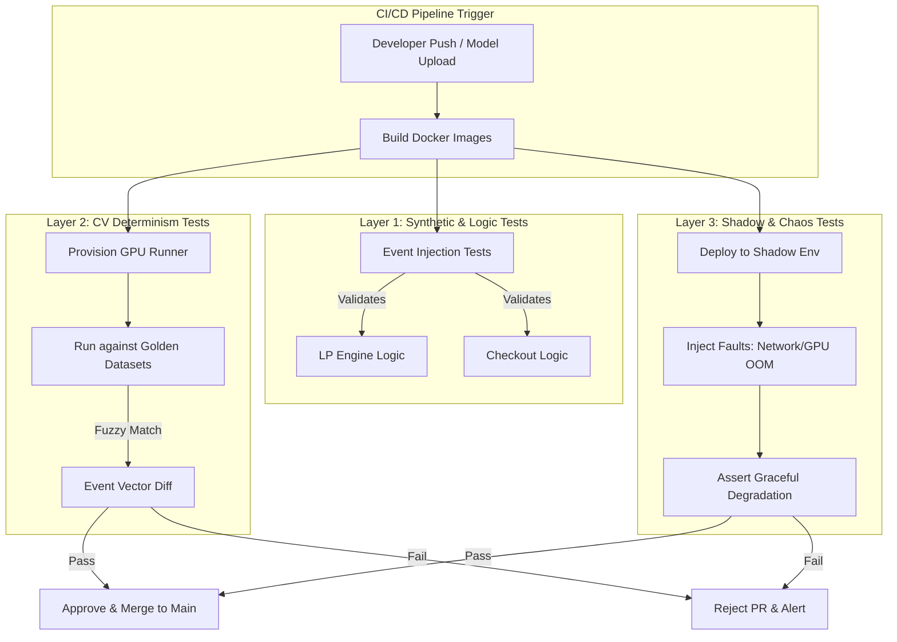

### 12.7 Testing Observability
Test results are not just pass/fail logs. They are treated as data. The CI pipeline pushes test metrics (model mAP, inference latency p99, event-match accuracy, memory consumption) to a dedicated Prometheus instance. We build a Grafana dashboard specifically for CI health, allowing engineers to visualize how introducing a new feature or model affects system performance over time, catching slow regressions that a simple binary pass/fail test would miss.

---
## 13. Enterprise Security Architecture
### 13.1 Why This Subsystem Exists
Retail Intelligence platforms represent a perfect storm of high-risk data. We process biometric data (gait, body proportions for ReID), personally identifiable information (faces), financial data (POS transactions), and confidential business intelligence (shrinkage metrics, employee performance). A breach here does not merely result in leaked passwords; it results in regulatory fines under GDPR/CCPA, class-action lawsuits over biometric privacy (e.g., Illinois BIPA), loss of enterprise retail contracts, and potential physical danger if LP evidence is leaked to bad actors. Security cannot be a "bolted-on" compliance checklist; it must be a foundational architectural constraint.

### 13.2 Authentication & Identity Federation
We strictly forbid the implementation of a custom authentication database. Password hashing, salting, brute-force protection, and MFA delivery are solved problems that we will not reinvent.
*   **Identity Provider (IdP):** We integrate with enterprise IdPs via SAML 2.0 or OpenID Connect (OIDC). Typical customers will use Okta, Azure AD, or Google Workspace.
*   **Token Strategy:** Upon login, the IdP issues a short-lived Access Token (JWT, 15-minute expiry) and a long-lived Refresh Token (stored securely in an HttpOnly, Secure, SameSite cookie). The Next.js frontend never sees the Access Token; it relies on a backend cookie-based session to prevent XSS token theft.
*   **Service-to-Service Auth:** Microservices in the cloud communicate using Kafka mutual TLS (mTLS) or gRPC with JWTs signed by an internal Certificate Authority (e.g., HashiCorp Vault PKI). Edge nodes authenticate to the cloud Kafka cluster using client certificates provisioned via a Cloud IoT core (e.g., AWS IoT Core or GCP IoT).

### 13.3 Authorization: ABAC over RBAC
Role-Based Access Control (RBAC) (e.g., "Admin", "Viewer") is too coarse for a multi-tenant retail platform. A regional manager for the "East Coast" should not be able to view stores in the "West Coast," and a store manager should not see enterprise-wide shrinkage aggregates.
*   **Attribute-Based Access Control (ABAC):** We implement an Open Policy Agent (OPA). OPA is deployed as a sidecar to our Backend API Gateway.
*   **Policy Evaluation:** When a user requests `GET /api/stores/123/analytics`, the API gateway sends the user's JWT claims (roles, assigned stores, region) and the request context (store_id: 123) to OPA. OPA evaluates a Rego policy file and returns `ALLOW` or `DENY`.
*   **Separation of Duties:** OPA enforces LP-specific rules. For example, an employee who has the `LP_Agent` role can view evidence videos, but only an employee with the `LP_Manager` role can unblur faces or export evidence packages for law enforcement.

## 13.4 The GDPR Paradox: PII vs. Computer Vision
There is an inherent conflict between training accurate computer vision models and complying with privacy regulations like GDPR (Europe) or CCPA (California). To track a person across a store, the system *must* rely on visual features—face, hair color, clothing, body shape. However, storing images of faces or using biometric identifiers (like gait) without explicit consent is a severe violation.
*   **The Transient Processing Exemption:** Under GDPR Article 6, processing personal data is lawful if it is "necessary for the performance of a contract" or for "legitimate interests" (loss prevention), provided data is not retained beyond the necessary timeframe. More importantly, processing that is strictly transient (in RAM) and does not result in a record is largely exempt from record-keeping requirements.
*   **Edge-Level Anonymization Pipeline:** We strictly enforce a "Never send raw PII to the cloud" rule. On the edge node, frames are processed in GPU memory for tracking. Before any frame or extracted image is written to Kafka, Redis, or S3, it passes through a lightweight, hardware-accelerated anonymization filter (using CUDA-based YOLO face detection + Gaussian blur or solid black box overlay).
*   **Short-Term vs. Long-Term State:** The system is allowed to hold unblurred pixels in the GPU frame buffer for a few hundred milliseconds to calculate optical flow and ReID embeddings. But the *moment* a frame is logged as an event (e.g., saved as a JPEG in the evidence bucket or passed to the cloud analytics DB), the face/body must be irreversibly obfuscated.
*   **Biometric Opt-Out Zones:** For strict compliance (e.g., Illinois BIPA), the Digital Twin includes defined "Opt-Out Zones" (e.g., a specific aisle or the entrance). If a customer steps into this zone, the tracking engine issues a `ForgetMe` command, immediately dropping their active tracklet and purging their ReID vector from the Qdrant database, forcing the system to treat them as a brand-new person if they leave the zone.

### 13.5 Crypto-Shredding & The Right to Be Forgotten
Because our database is event-sourced, a customer's journey is spread across millions of immutable events in ClickHouse and Kafka. If a customer exercises their "Right to be Forgotten" (GDPR Article 17), we cannot simply run a `DELETE FROM events WHERE session_id = 'X'` without breaking the event chain and corrupting our aggregate state.
*   **The Solution:** We encrypt PII fields at the application layer *before* writing to the event bus. Specifically, fields like `session_id` (which links physical movements to a specific person) or `employee_id` are encrypted using an AEAD (Authenticated Encryption with Associated Data) cipher.
*   **Per-Tenant Data Keys:** The encryption key used for a specific store or tenant is managed by HashiCorp Vault.
*   **Deletion Execution:** When a deletion request is approved, we do not scan billions of events. Instead, we simply delete the specific encryption key from Vault. Without that key, the encrypted `session_id` fields in ClickHouse and Kafka become mathematically irreversible randomized strings. The events remain (preserving system integrity, total store foot-traffic counts, etc.), but the link to the individual human is permanently destroyed. This is known as Crypto-Shredding.

### 13.6 Secrets Management
Hardcoding API keys, database passwords, or mTLS certificates in Docker images or Kubernetes YAML files is an immediate critical vulnerability.
*   **HashiCorp Vault Integration:** We deploy a highly available Vault cluster.
*   **Dynamic Secrets:** We do not use long-lived database passwords. When the ClickHouse or PostgreSQL pod starts up, it authenticates to Vault using its Kubernetes Service Account JWT. Vault then *generates* a unique, short-lived (e.g., 1-hour TTL) database credential on the fly. If an attacker compromises the pod, they only steal a credential that expires in an hour and only has access to the specific schema that pod requires.
*   **Edge Node PKI:** Edge devices are provisioned with SPIFFE/SPIRE (Secure Production Identity Framework for Everyone). This automatically rotates mTLS certificates on the edge devices every hour, ensuring that if an edge node is physically stolen, the attacker cannot impersonate it on the network for longer than the rotation window.

### 13.7 Immutable Audit Logging & Tamper Detection
If an LP agent exports an evidence video and leaks it to the press, or if a store manager fraudulently alters inventory data, we must have an irrefutable record of who did what and when.
*   **Append-Only Architecture:** Standard databases allow `UPDATE` and `DELETE`. We build a separate Audit Log microservice that only accepts `INSERT` operations. It listens to a Kafka topic (`security.audit_logs`).
*   **WORM Storage:** The audit log sinks to an S3/MinIO bucket with Object Lock enabled (WORM - Write Once Read Many). Even the root AWS/GCP admin, or our own backend database administrators, cannot delete or alter an audit log entry for a mandated retention period (e.g., 7 years for financial/loss-prevention compliance).
*   **Contextual Binding:** Audit logs capture the `actor_id`, the `action` (e.g., `EVIDENCE_UNBLURRED`, `INVENTORY_ADJUSTED`), the `target_resource`, the `timestamp`, and the `source_ip`. 
*   **Chain of Custody Hashing:** When the LP system generates an evidence video, it calculates a SHA-256 hash of the MP4 file. This hash is embedded into the audit log. If the video is presented in a legal proceeding, recalculating the hash and matching it to the immutable audit log proves the video has not been tampered with since it was generated by the AI.

### 13.8 Network Security & Zero Trust
We assume the internal network is as hostile as the public internet.
*   **Service Mesh:** We deploy Istio or Linkerd as a service mesh across the Kubernetes clusters. This forces all inter-service traffic (even internal ones) to use mTLS. 
*   **Network Policies:** Kubernetes `NetworkPolicies` are strictly defined. The Computer Vision pods cannot initiate connections to the PostgreSQL database pods; they can only speak to the Kafka pods. If a CV pod is compromised, the blast radius is confined to Kafka, not the user database.
*   **Edge-to-Cloud VPN:** Edge nodes do not have public IP addresses. They initiate an outbound WireGuard or IPSec VPN tunnel to a cloud bastion host. All Kafka traffic flows through this encrypted tunnel. Because the connection is outbound-only, attackers cannot scan or access the edge nodes directly from the internet.

---
## 14. Observability & Monitoring
### 14.1 Why This Subsystem Exists
In a monolithic application, when something breaks, you read the stack trace. In a distributed, asynchronous, event-sourced system spanning edge hardware, cloud GPUs, and multiple database technologies, a single user action (e.g., "Load the heatmap") might traverse the Next.js frontend, a backend API, ClickHouse, and a Kafka consumer, resulting in latency that spans hundreds of milliseconds across multiple network hops. When a store manager complains that "the dashboard is slow," or an ML engineer notices "model accuracy dropped," raw logs are useless. We need a unified observability strategy based on the three pillars: Metrics, Logs, and Traces, integrated via correlation IDs.

### 14.2 The Correlation Strategy (Distributed Tracing)
To connect the dots across microservices, every request and every event must carry a trace context.
*   **W3C Trace Context:** We strictly adopt the W3C `traceparent` standard. Every HTTP request from the Next.js portal includes a `traceparent` header. Every Kafka message includes `trace_id` and `span_id` in its message headers (supported natively by Confluent Kafka).
*   **OpenTelemetry (OTel):** We do not use vendor-specific tracing agents. We instrument all microservices (Golang, Python, Node.js) with the OpenTelemetry SDK. OTel acts as a vendor-agnostic instrumentation layer.
*   **Trace Propagation Example:** 
    1. Next.js generates `trace_id: A`, `span_id: 1`. Sends HTTP request to API.
    2. API fetches from Redis. Emits Span 2.
    3. API emits event to Kafka with `trace_id: A` in the header.
    4. LP Engine consumes the Kafka event, continues `trace_id: A`, emits Span 3 (Hypothesis Evaluation).
    5. We can now view a single waterfall chart showing exactly how long the frontend request took, how long the API took, and how long the asynchronous LP processing took, all linked by Trace ID A.

### 14.3 Metrics: The Golden Signals
We use Prometheus as the time-series metrics sink and Grafana for visualization. We do not track "everything." We strictly focus on the Four Golden Signals defined by Google SRE, highly customized for our retail domain.

*   **Latency:**
    *   *Business:* Time taken to generate an Evidence Package (p99).
    *   *CV:* End-to-end frame ingestion to event emission latency.
    *   *Inference:* Time spent in the Triton GPU queue vs. actual model execution time.
*   **Traffic:**
    *   Events per second ingested per store.
    *   Number of active `session_id` tracklets in Redis.
    *   Query per second (QPS) hitting the ClickHouse analytics endpoint.
*   **Errors:**
    *   Kafka DLQ insertion rate (critical alert).
    *   Ratio of `Unscanned Items` to `Total Items` (indicates a CV or POS failure, not just theft).
    *   HTTP 5xx rates.
*   **Saturation:**
    *   GPU Memory utilization and Thermal Throttling percentage (NVIDIA DCGM-Exporter).
    *   Kafka consumer group lag (if lag grows continuously, the consumer is saturated and falling behind real-time).
    *   ClickHouse `MaxPartCountPerTable` (indicates too many small inserts, causing I/O starvation).

### 14.4 Structured Logging
We strictly forbid unstructured, human-readable string logs (e.g., `logger.info("User John logged in from 192.168.1.1")`). Unstructured logs cannot be efficiently parsed or aggregated.
*   **Format:** All logs are emitted as JSON to standard output (stdout).
*   **Schema:** Every log entry *must* contain: `timestamp`, `level`, `service_name`, `trace_id`, `span_id`, `message`, and a dynamic `metadata` object.
*   **Log Aggregation:** We use Loki (by Grafana Labs). Unlike Elasticsearch, Loki does not index the log text; it only indexes labels (like `service_name` and `trace_id`). This reduces storage costs by 10x.
*   **Querying:** In Grafana, if an alert fires for high latency on Trace ID A, we click the alert, which runs a Loki query: `{trace_id="A"}`, instantly pulling all JSON log lines from the frontend, API, and CV services related to that exact request.

### 14.5 GPU & Edge Hardware Telemetry
GPUs are black boxes to standard system monitors. A CPU spike means nothing if the GPU is idle, or vice versa.
*   **NVIDIA DCGM-Exporter:** Deployed as a DaemonSet on edge Kubernetes nodes. It exposes Prometheus metrics specifically for GPUs: SM (Streaming Multiprocessor) clock, memory clock, power draw (watts), temperature, and compute utilization.
*   **Custom CV Metrics:** The Triton Inference Server exposes metrics per model. We build custom Grafana dashboards showing:
    *   `triton_inference_request_count` (How many frames are being processed).
    *   `triton_gpu_memory_used_bytes` (Per model, to detect memory leaks in ONNX execution).
    *   `cv_dropped_frames_total` (Counter incremented by the ingestion layer when it has to discard a frame due to backlog).
*   **Camera Health:** The ingestion service emits a heartbeat metric (`camera_heartbeat_seconds`) per RTSP stream. If the heartbeat stops, Grafana triggers a "Camera Offline" alert routed to the operations dashboard.

### 14.6 Alerting Strategy & Fatigue Prevention
Alert fatigue kills operations teams. If a pager goes off at 3 AM for a non-critical issue, engineers will start ignoring alerts, missing the real fires.
*   **Severity Levels:**
    *   *P1 (Page - Immediate):* Edge node completely offline, Kafka cluster partition down, GPU thermal throttling causing complete tracking failure. Pages the on-call SRE via PagerDuty.
    *   *P2 (Slack - Urgent):* Single camera disconnected, DLQ backlog > 1000 messages, inference latency p99 > 200ms. Routes to a Slack channel.
    *   *P3 (Ticket - Normal):* ClickHouse query latency degradation, minor model confidence drift. Automatically creates a Jira/Linear ticket for daytime investigation.
*   **Multi-Window, Multi-Burn-Rate Alerts:** We do not alert on static thresholds (e.g., "Alert if latency > 100ms"). We use the SRE burn-rate approach. We define SLOs (Service Level Objectives), e.g., "99% of CV inference requests must be < 100ms over a 5-minute window." Alerts only fire if the error budget is being burned faster than a calculated rate, preventing false positives during short-term traffic peaks。

### 14.7 Model & Data Drift Observability
Standard DevOps observability does not cover ML models. A deployed model will silently degrade as store lighting changes with seasons, or as product packaging updates.
*   **Confidence Histograms:** We pipe the `confidence` score of every detected object into a Prometheus histogram. In Grafana, we overlay the confidence distribution of the last 24 hours against the baseline (golden dataset). If the current distribution shifts left (lower confidence), an alert fires: "Potential Data Drift in Store 04."
*   **Feature Store Monitoring:** We log the input features to our models (e.g., average brightness of the frame, size of the bounding box in pixels). If the average brightness of Camera 3 drops significantly, the system alerts operations that the camera lens might be dirty or a store light is burned out, *before* it severely impacts the CV accuracy.

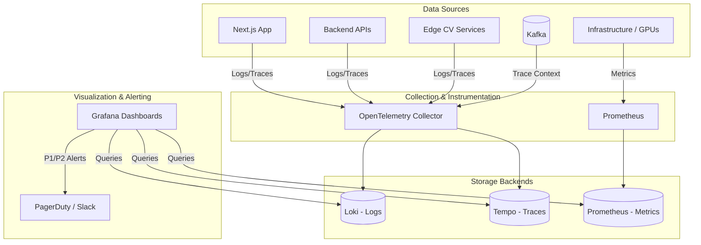

---
## 15. Deployment, Infrastructure & DevOps
### 15.1 Why This Subsystem Exists
Deploying a standard SaaS application involves pushing a Docker image to a cloud cluster and shifting traffic. Deploying a Retail Intelligence Platform involves pushing gigabytes of CUDA-compiled binaries to hundreds of geographically distributed, physically secure edge appliances inside retail stores, often over unreliable DSL connections, without ever interrupting the live video feeds. A failed deployment in a traditional web app results in a 500 error; a failed deployment in our system results in a store losing its loss prevention capabilities and analytics, which violates enterprise SLAs. The Infrastructure and DevOps subsystem must abstract this massive complexity into a single, automated, immutable, and reversible pipeline.

### 15.2 Containerization Strategy (Docker)
We do not ship raw Python scripts or Go binaries. Everything is containerized, but standard Docker practices will fail spectacularly in a CV environment.
*   **The Base Image Problem:** Standard `ubuntu` or `python` base images lack the underlying CUDA libraries, driver compatibilities, and FFmpeg dependencies required for video decoding and GPU inference.
*   **The NVIDIA Container Toolkit:** All services requiring GPU access must be built on top of the official `nvidia/cuda` runtime images.
*   **Multi-Stage Builds to Reduce Bloat:** A naive CV Docker image can easily exceed 8GB. We strictly enforce multi-stage builds.
    *   *Stage 1 (Builder):* Uses a heavy `nvidia/cuda:12.1-devel-ubuntu22.04` image. Compiles custom FFmpeg branches with NVDEC support, installs Python, and pulls PyTorch/TensorRT.
    *   *Stage 2 (Runtime):* Uses a minimal `nvidia/cuda:12.1-runtime-ubuntu22.04` image (which lacks compilers, saving ~3GB). We copy only the compiled binaries, Python virtual environments, and necessary shared libraries (`.so` files) from the builder stage.
*   **Process Separation:** We do not put the video ingestion, the model inference, and the Kafka producer in one monolithic container. We separate them into distinct containers (`ingestor`, `inference-server`, `state-publisher`) so they can be independently restarted, scaled, and have their logs isolated.

### 15.3 Edge Infrastructure: K3s vs. Standard Kubernetes
Running a full Kubernetes cluster (like standard GKE or EKS) on a retail edge node (typically an NVIDIA Jetson AGX Orin or a Dell PowerEdge with a T4 GPU) is impossible due to RAM and CPU overhead.
*   **The Choice: K3s.** K3s is a highly available, certified Kubernetes distribution designed for production workloads in unattended, resource-constrained, remote locations.
*   **Why not Docker Compose?** Docker Compose does not provide self-healing beyond simple restarts. It lacks declarative state, advanced secret management, or service discovery. If an edge node reboots due to a power outage, Compose might fail to mount volumes correctly. K3s provides the exact same declarative API as cloud Kubernetes, allowing us to use the same deployment manifests (with minor resource limits adjusted) for both edge and cloud.
*   **SQLite Backend:** K3s replaces etcd with SQLite. For a single-node edge cluster, etcd is massive overkill and consumes too much memory. SQLite is perfectly suited for a single-node state store and drastically reduces edge footprint.

### 15.4 Air-Gapped Deployments & Image Distribution
Most retail stores do not have the bandwidth to pull a 3GB Docker image from Docker Hub or AWS ECR during a deployment window.
*   **S3 Edge Sync:** We run a lightweight daemon on the edge node that polls a regional S3 bucket. During off-peak hours (e.g., 2:00 AM), it downloads the compressed OCI image layers.
*   **USB Physical Air-Gap:** For stores with strictly no internet access (common in certain big-box retail backrooms), the CI/CD pipeline outputs the Docker images as `.tar` archives. These are loaded onto encrypted USB drives and physically shipped to the stores, where a store manager plugs them into the edge appliance, and a local script runs `k3s ctr images import /mnt/usb/image.tar`.

### 15.5 Fleet Management & GitOps
Managing 500 individual K3s clusters via SSH or custom scripts is an operational nightmare.
*   **Fleet (Rancher) or ArgoCD Edge:** We deploy a central GitOps control plane in the cloud. Edge nodes bootstrap by connecting to this control plane via a mutual TLS VPN tunnel (like WireGuard).
*   **Declarative State:** A store's configuration (which cameras to ingest, which models to load, what Kafka topic to publish to) is defined in a `StoreCustomResource` YAML file in a Git repository.
*   **Reconciliation Loop:** The edge agent constantly compares its local state with the Git repository. If an engineer changes a camera's RTSP URL in Git, the edge agent detects the drift and automatically reconfigures the ingestion pod. If a store employee maliciously alters a config file on the local edge node, the agent overwrites it within minutes, ensuring infrastructure integrity.

### 15.6 GPU Scheduling & Resource Isolation
On the edge, we have exactly one GPU. We must ensure the inference pipeline gets absolute priority, while background tasks (like log shipping or model downloading) do not cause the CV pipeline to drop frames.
*   **NVIDIA Device Plugin:** Installed on K3s to advertise the GPU to the Kubernetes scheduler.
*   **Compute Limits:** While K8s cannot natively partition a GPU into fractional slices (without complex MIG setups on A100s), we use `requests` and `limits` for CPU and RAM. The inference container gets the highest CPU priority (Guaranteed QoS class). If the node runs out of RAM, K8s will evict the log-shipping pod, never the inference pod.
*   **CUDA_MPS (Multi-Process Service):** If we need to run multiple distinct containers that all require GPU access (e.g., one for YOLO, one for ReID), we enable NVIDIA MPS on the edge node. MPS creates a virtual GPU context for each process, allowing them to share the physical GPU without context-switching overhead, preventing one container from monopolizing the GPU memory.

### 15.7 CI/CD Pipeline & Zero-Downtime Deployment
Our pipeline is split into Cloud and Edge paths.

**Cloud Path (Next.js, APIs, ClickHouse):**
1.  **Build:** GitHub Actions triggers on merge to `main`.
2.  **Test:** Runs unit tests, synthetic event injection tests (Section 12).
3.  **Scan:** Trivy scans the Docker image for CVEs (Critical/High vulnerabilities block the pipeline).
4.  **Push:** Pushes to AWS ECR.
5.  **Deploy (ArgoCD):** ArgoCD detects the new image digest in the Helm chart.
6.  **Canary Deployment (Istio):** For backend APIs, Istio shifts 5% of traffic to the new pod version. If the p99 latency in Grafana does not degrade over 10 minutes, it shifts to 50%, then 100%. If it degrades, it automatically rolls back.

**Edge Path (CV Pipeline):**
Canary deployments are impossible on a single edge node. We use a **Ring Deployment** strategy combined with **Shadow Mode**.
1.  **Shadow Validation:** The new CV image is deployed alongside the old one on a few test stores. Both process the same video, but only the old one's events go to Kafka. The new one's events go to the shadow topic. ML engineers compare them.
2.  **Ring 1 (Canary Stores):** Once validated, we update 5% of production stores (e.g., low-traffic locations).
3.  **Rollback Mechanism:** K3s tracks the previous Docker image digest. If the store manager reports an issue (e.g., via a critical alert in Grafana), a single CLI command (`fleet rollback store-123`) instantly reverts the edge pods to the previous image. The state in Redis/Kafka seamlessly picks up where it left off due to idempotent event processing.

### 15.8 Infrastructure as Code (IaC)
We refuse to click through cloud consoles. All infrastructure is version-controlled.
*   **Terraform:** Provisions the cloud VPCs, EKS clusters, MSK (Managed Kafka), S3 buckets with WORM locking, and IAM roles. We use Terraform Cloud for remote state management and strict PR-based plan/apply workflows.
*   **Helm Charts:** All Kubernetes manifests are templated using Helm. This allows us to inject environment-specific variables (e.g., different Kafka broker IPs for dev vs. prod) without duplicating YAML files.
*   **Ansible:** Used for bare-metal provisioning *before* K3s is installed. Ansible playbooks handle the OS-level hardening: disabling swap (critical for Kubernetes performance), setting ulimits, installing NVIDIA drivers, and formatting NVMe storage arrays for the video ring buffers.

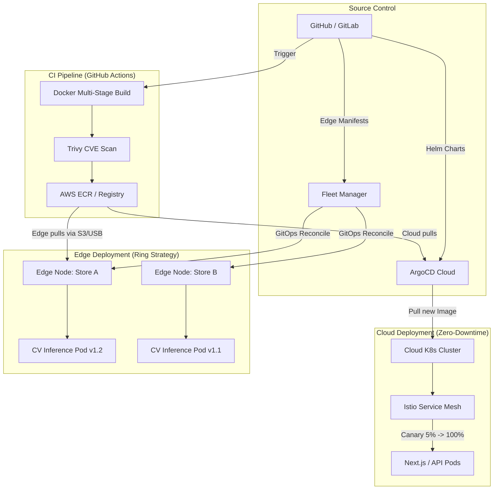

---
## 16. Future Roadmap & Extensibility
### 16.1 Why This Subsystem Exists
An enterprise architecture that cannot evolve becomes a legacy burden within three years. The retail technology landscape is rapidly shifting from pure computer vision toward "Sensor Fusion" (combining vision with RFID, weight, and LiDAR) and Generative AI. If our current architecture tightly couples the assumption that "all knowledge comes from cameras," integrating these future technologies will require a ground-up rewrite. This section defines the architectural extension points already baked into our current design, and details the engineering required to activate advanced capabilities such as autonomous drones, predictive supply chains, and on-premise LLMs.

### 16.2 Advanced Sensor Fusion Architecture
Currently, our system relies on a single sensory modality: video. This creates a hard ceiling on accuracy. Identical packaging, severe occlusion, and poor lighting will always cause pure CV to fail at least 1-2% of the time. To achieve the 99.9% accuracy required for fully autonomous "walk-out" technology, we must evolve into a multi-modal Sensor Fusion platform.

*   **The Architecture Extension:** We introduce a new bounded context: the `Sensor Fusion Engine`. This is not a simple aggregation script; it is a probabilistic data fusion layer built using a **Multi-Modal Bayesian Network**.
*   **Integrating Shelf-Scale Weight Sensors:** We instrument shelves with IoT load cells that stream weight deltas (e.g., `Shelf 4, Zone 2: -450 grams`). 
    *   *The Problem:* Weight sensors are noisy. A customer leaning on the shelf or shifting items triggers false positives.
    *   *The Fusion Logic:* The fusion engine receives a weight drop event. It queries the CV engine: "Did the CV pipeline observe a product being removed from Shelf 4, Zone 2 in the last 2 seconds?" 
    *   If **Yes**, the system multiplies the posterior probabilities: $P(Pickup | CV \cap Weight) > 0.99$. The event is promoted to a `VerifiedPickup`.
    *   If **No** (e.g., the weight dropped but no one was near the shelf), the system classifies it as an `AnomalousWeightShift` (possibly indicating a product fell behind the shelf or the sensor drifted), preventing a false inventory deduction.
*   **Integrating RFID:** Reading RFID tags at exits is standard, but reading them on shelves is complex due to signal bounce and liquid interference. We treat RFID as a secondary validator. If a customer exits, the CV cart says 3 items, and the RFID gate reads 4 tags, the system triggers a `DiscrepancyResolution` workflow, potentially indicating a CV tracking failure or a tagged item hidden in a stroller.
*   **Smart Carts:** Carts equipped with built-in barcode scanners and weight scales communicate via BLE. The fusion engine maps the cart's internal state to the CV-observed customer session, providing a ground-truth anchor that completely eliminates the need for checkout verification.

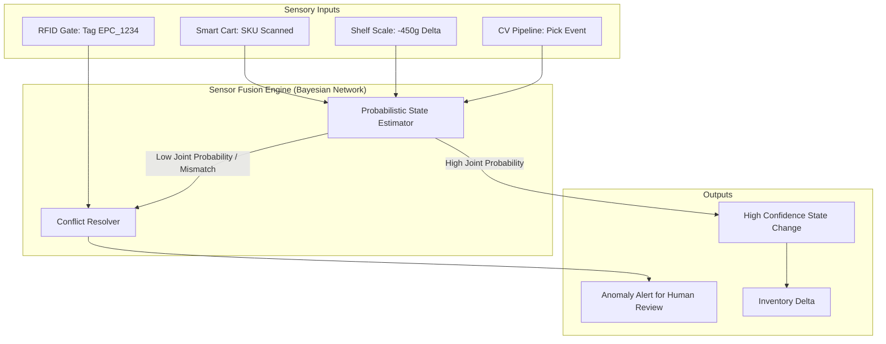

### 16.3 Generative AI & On-Premise LLM Integration
Dashboards, no matter how well designed, require users to know what questions to ask. The future of retail analytics is conversational. However, sending proprietary store data (sales, shrinkage, customer behavior) to public APIs like OpenAI is a direct violation of enterprise data governance policies.

*   **The Architecture:** We deploy Local Large Language Models (LLMs) using vLLM or TensorRT-LLM on cloud GPU nodes isolated from the CV pipeline.
*   **Retrieval-Augmented Generation (RAG):** We do not rely on the LLM's parametric memory. We build a RAG pipeline:
    1.  **Query Translation:** The user asks, "Why did meat sales drop in Store 4?" The LLM translates this into a series of tool calls.
    2.  **Tool Execution:** The backend executes the tools (e.g., querying ClickHouse for meat SKU sales, querying the weather API for local temperature drops, querying the inventory system for out-of-stock events).
    3.  **Context Assembly:** The retrieved data tables are injected into the LLM's prompt context window.
    4.  **Synthesis:** The LLM generates a natural language explanation, *and* generates the JSON payload required to render a Chart.js/Recharts visualization in the frontend.
*   **Security & Guardrails:** LLMs are susceptible to prompt injection. We implement NeMo Guardrails. The guardrail layer sits between the frontend and the LLM. It enforces topical restrictions (the LLM is not allowed to discuss HR data, only retail metrics) and ABAC enforcement (if the user's JWT does not have access to Store 4, the guardrail blocks the tool execution, and the LLM responds, "I do not have permission to view Store 4 data").
*   **Voice-Activated Store Assistant:** For store managers on the floor carrying tablets, we integrate Whisper (OpenAI's speech-to-text model) running locally on the tablet to convert voice to text, pass it through the RAG pipeline, and use a local text-to-speech engine to read the AI's analysis aloud.

### 16.4 Predictive Analytics & Supply Chain Integration
Moving from descriptive analytics ("what happened") to predictive analytics ("what will happen") requires time-series forecasting models and deep ERP integration.

*   **Demand Forecasting Engine:** We train Temporal Fusion Transformers (TFT) on historical ClickHouse data. Unlike standard ARIMA models, TFT handles complex temporal dynamics, static covariates (store size, demographic data), and known future inputs (upcoming holidays, planned promotions).
*   **Predictive Restocking:** The TFT model outputs a probability distribution of future demand per SKU. If the predicted demand for the next 4 hours exceeds the current CV-observed shelf capacity, the system emits a `RestockAlert` event.
*   **ERP Bi-Directional Sync (SAP/Oracle):** 
    *   *Outbound:* We push our "Vision-Derived Inventory State" (highly accurate, real-time) to the ERP via standard IDocs or REST APIs. The ERP uses this to trigger automated purchase orders.
    *   *Inbound:* The ERP pushes "Inbound Logistics" data to our platform. When a truck arrives at the backdoor, the Digital Twin highlights the receiving area, and the system temporarily suppresses "Out of Stock" alerts for those SKUs, knowing they are currently being moved to the floor.
*   **Planogram Optimization via Reinforcement Learning:** We treat the store layout as an RL environment. The state is the current Digital Twin and historical traffic heatmaps. The action is swapping the positions of two products. The reward function is the increase in CV-observed "Pickup Rate" minus a penalty for increased " Occlusion Time." Over thousands of simulated iterations in the Digital Twin, the RL agent outputs an optimized planogram that maximizes sales velocity.

### 16.5 Autonomous Robotics & Drone Integration
Top-down cameras cannot see the bottom shelves, and setting up cameras in massive warehouse-style retail (like Lowe's or Walmart) is cost-prohibitive. Autonomous robots and drones act as mobile, high-definition sensors.

*   **Architecture Extension:** Robots and drones are treated exactly like mobile IP cameras, but with highly accurate self-localization capabilities.
*   **Integration via SLAM:** The robot runs its own Simultaneous Localization and Mapping (SLAM) algorithm using LIDAR. It streams its RTSP video feed *and* its real-time $(X, Y, Z, \text{Yaw})$ coordinates to our Kafka cluster.
*   **Dynamic Digital Twin Updates:** As the robot moves down an aisle, it acts as a temporary camera node. The Digital Twin engine dynamically updates the `Camera` node's position and FoV based on the robot's telemetry.
*   **Blind Spot Eradication:** When the robot enters a known "Blind Spot" (calculated in Section 6), the Session Reconstruction service dynamically starts ingesting the robot's video feed to maintain tracking continuity for customers in that aisle.
*   **Drone Inventory Scanning:** For high-ceiling warehouse environments, drones fly predefined routes at night, taking ultra-high-resolution pictures of top shelves. These images are batch-processed through a specialized high-resolution product detection model (which doesn't need real-time latency) to generate highly accurate overnight inventory audits, reconciling the CV-driven inventory state with the physical truth.

### 16.6 Automatic Camera Placement Optimization (Sim2Real)
Currently, humans use the Digital Twin builder to place cameras. This is suboptimal. We will build an automated system that tells the store exactly where to hang cameras to achieve 99% coverage at the lowest cost.

*   **The Algorithm:** We use a Genetic Algorithm (GA) combined with a Raytracing Engine.
*   **The Simulation (Sim):** We load the 3D Digital Twin (without cameras) into a headless 3D engine (e.g., Blender with PyBullet). We generate 10,000 synthetic customer trajectories using historical ClickHouse data.
*   **The Optimization Loop:**
    1.  The GA creates a "generation" of 100 different camera placement configurations (genes = camera coordinates and pitch/yaw).
    2.  For each configuration, the raytracer calculates the total floor/shelf coverage percentage.
    3.  We simulate the 10,000 trajectories. If a customer walks through a blind spot for $>3$ seconds, the configuration incurs a penalty.
    4.  The configurations are ranked by `Score = (Coverage %) - (Cost * Number of Cameras) - (Blind Spot Penalty)`.
    5.  The top configurations "breed" and "mutate" to form the next generation.
*   **The Output:** After hundreds of generations, the system outputs the Pareto-optimal camera placement map. The system then generates a "Bill of Materials" (BOM) and an installation guide (PDF with exact ceiling tile coordinates) for the store's installation contractor.

### 16.7 Architectural Guarantees for the Future
To ensure these future capabilities can be integrated without a rewrite, the current architecture adheres to the following strict design principles:
1.  **The "Blind" Pipeline:** The Session Reconstruction and LP engines do not know *how* an event was generated. They only consume the standard `Event` schema. Whether that event came from a ceiling camera, a drone, a weight sensor, or a smart cart, the downstream business logic remains entirely untouched.
2.  **Capability Flags via Feature Toggles:** The Digital Twin schema already includes a `capabilities` array for sensors. If a store does not have weight sensors, the Sensor Fusion engine simply disables those Bayesian rules via a feature flag (`feature_weight_fusion_enabled: false`), allowing seamless gradual rollouts of new hardware.
3.  **Horizontal Scalability of the Ingestion Bus:** Kafka topics are partitioned by store and session. Adding 50 drones to a warehouse simply means adding more partitions and consumer instances; it does not require architectural changes to the broker topology.

---
